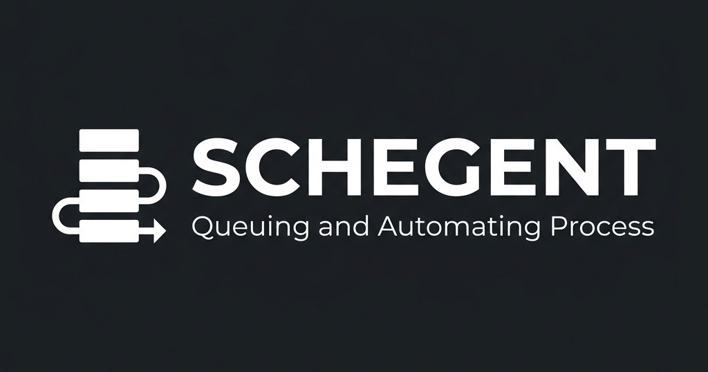

# Schegent



[](LICENSE.md)
[](https://code.visualstudio.com/)
[](https://nodejs.org/)

> Autonomously orchestrate the Claude Code CLI to drive the Spec Driven Development
> workflow pipeline — without leaving VS Code.

**Schegent** is a Visual Studio Code extension that runs the
[Claude Code CLI](https://docs.claude.com/claude-code) as a headless
backend and walks it through the seven Spec Driven Development workflow phases
on your behalf. You enqueue a feature request in the sidebar, walk
away, and come back to either a completed feature or a paused run
waiting for an operator decision.


---

## Table of contents

1. [What it does](#what-it-does)
2. [Requirements](#requirements)
3. [Installation](#installation)
4. [Quick start](#quick-start)
5. [Key features](#key-features)
6. [Documentation](#documentation)
7. [Common commands](#common-commands)
8. [Configuration](#configuration)
9. [On-disk layout](#on-disk-layout)
10. [Security posture](#security-posture)
11. [Building from source](#building-from-source)
12. [Reporting bugs](#reporting-bugs)
13. [License](#license)

---

## What it does

Schegent treats each Spec Driven Development workflow phase as a discrete CLI invocation, then
strings the phases together inside an orchestrator that handles:

- **Queueing and concurrency** — exactly one in-flight run per
  workspace, with a visible queue of pending tasks.
- **Pausing and resuming** — pause mid-phase, inspect the audit log,
  and resume from where you stopped.
- **Failure recovery** — automatic retries for transient and
  rate-limit failures, manual overrides for everything else.
- **Customization** — override the model, effort, timeout, or
  loopability of any phase without forking the pipeline; add your own
  phases and pipelines through workspace settings.
- **Observability** — a sanitized, append-only audit log; opt-in
  unredacted diagnostics for deep troubleshooting; a sanitized runtime
  log that mirrors the VS Code Output channel to disk.
- **Unattended execution** — an OS-native wake-up scheduler
  (launchd / Task Scheduler / cron / systemd-user) keeps your Claude
  rolling-allocation warm so unattended pipelines do not pay the
  cold-start cost.

Schegent does not replace the Spec Driven Development workflow slash commands you already use
interactively — it drives the same pipeline non-interactively from a
queue.

## Requirements

- **Visual Studio Code** `^1.85.0` (April 2024 or newer).
- **Node.js** `>= 20` (for building from source; not required to run
  the published extension).
- At least one supported backend CLI installed and authenticated: **Claude
  Code** (`schegent.cli.path`), **Codex** (`schegent.codex.path`), or **Agy**
  (`schegent.agy.path`). Claude is the default backend. Cloud-backed execution
  may require provider connectivity; Schegent is
  [local-first, not an offline-execution promise](docs/concepts/local-first-not-offline.md).
- A **trusted workspace folder** open in VS Code. Schegent is
  intentionally inert in untrusted workspaces.
- **Plugins**: Ensure you have installed and set up the **Github Speckit** and **Superpowers** plugins to enable the complete spec-driven development experience.

## Installation

### Building the extension locally

To build your own `.vsix` extension package:

1. Clone the repository and navigate to the `repo/` directory:
   ```bash
   cd repo
   ```
2. Install dependencies:
   ```bash
   npm install
   ```
3. Build the host and webview bundles:
   ```bash
   npm run build
   ```
4. Package the extension into a `.vsix` artifact:
   ```bash
   npm run package
   ```

### Installing the `.vsix` artifact

Once you have the `.vsix` file:

```bash
code --install-extension schegent-*.vsix
```

After install, reload VS Code, open a workspace folder, and accept the
workspace-trust prompt.

### Verify the CLI link

Open the Schegent sidebar (activity bar icon). The header badge shows
one of:

- **CLI ready** (green) — Schegent found and authenticated the CLI.
- **CLI not found** (red) — set the path setting for the selected backend.
- **CLI unauthenticated** (yellow) — authenticate the selected backend in a
  fresh terminal, then click the badge to re-probe.

### Fast Troubleshooting

| Symptom | Check | Recovery |
|---|---|---|
| Sidebar shows **CLI not found** | The selected backend path and your shell `PATH` may differ from VS Code's extension-host environment. | Set `schegent.cli.path`, `schegent.codex.path`, or `schegent.agy.path` to the corresponding absolute binary path, then re-probe. |
| Sidebar shows **CLI unauthenticated** | The backend CLI may not have a valid local session. | Run the backend login command in a normal terminal, then re-probe from Schegent. |
| Run pauses on rate limit | The CLI returned a recoverable quota/reset signal. | Leave the queue paused for automatic backoff, or resume manually after credits recover. |
| Secondary VS Code window is read-only | Another window owns the workspace lock. | Use the primary window for mutations, or close/reopen windows after the active run finishes. |
| Audit/log view looks stale or shows **evidence unavailable** | The durable audit sink or workspace disk may be failing. | Execution fails closed and queue drain stops. Inspect free space/permissions, then reload the window; see [Execution Evidence Health](docs/operations/evidence-health.md). |

## Quick start

1. Open the Schegent sidebar.
2. Click **Enqueue Feature Request** (or run
   `Schegent: Enqueue Feature Request` from the command palette).
3. Enter a short, declarative description of what you want built.
4. Confirm the pipeline selection (`speckit-new-feature` by default).
5. Watch the **In-flight** card. Each phase reports its progress in
   the **Phase Log Feed** below.

When the run finishes, the task moves to **History**. To rerun, right-
click and choose **Rerun from History**. To inspect what happened,
click **Show Audit Log** or open
`<workspaceRoot>/.schegent/audit.log` directly.

For a full walkthrough see [docs/getting-started/first-pipeline.md](docs/getting-started/first-pipeline.md).

## Key features

| Feature | Summary |
|---|---|
| **Two built-in pipelines** | `speckit-new-feature` (7 phases) and `speckit-bugfix` (5 phases). |
| **Phase overrides** | Per-phase model, effort, timeout, retry condition, loopability — merged across four precedence layers. |
| **Custom phases & pipelines** | Define your own phases through `schegent.phases` / `schegent.pipelines`; they run through the same audit path as the built-ins. |
| **Phase breakpoints** | Pause a run before a named phase to review state and intervene; consumed on fire. |
| **Aggressive pause** | SIGTERM at click time with a 2s SIGKILL escalation; state is updated before the kill so the audit record never lies. |
| **Rate-limit handling** | Parses Anthropic reset hints and schedules a dynamic backoff (5-attempt cap, 60-minute fallback). |
| **Fatal signatures** | A code-resident floor of unrecoverable error patterns plus operator-additive entries through `schegent.fatalSignatures`. |
| **Context-preserving retries** | Pass `-c` / `--continue` to a retry so Claude resumes the prior context (Claude backend). |
| **Verbose diagnostics (opt-in)** | Per-phase unredacted `debug.json`, `stream.jsonl`, and `verbose.log` captures for deep troubleshooting. |
| **Wake-up scheduler** | OS-native, per-user; chronological (`HH:MM`) or periodic (`Every Nm`/`Every Nh`). |
| **Auto-compact override** | Export `CLAUDE_AUTOCOMPACT_PCT_OVERRIDE` to control when Claude compacts context, per workspace. |
| **Multi-window safe** | Secondary VS Code windows are read-only; only the primary host mutates state. |
| **Backend abstraction** | Pluggable per-phase `BackendRunner` contract; `claude` (default), `codex`, and `agy` ship in-tree. |

## Documentation

The full operator manual lives under [`docs/`](docs/). Start with:

- [`docs/README.md`](docs/README.md) — manual index.
- [`docs/getting-started/installation.md`](docs/getting-started/installation.md) — install and link the CLI.
- [`docs/getting-started/first-pipeline.md`](docs/getting-started/first-pipeline.md) — end-to-end first run.
- [`docs/getting-started/sidebar-tour.md`](docs/getting-started/sidebar-tour.md) — every panel and what it does.

By topic:

- **Concepts** — [pipelines & phases](docs/concepts/pipeline-and-phases.md), [the queue, tasks, and runs](docs/concepts/queue-and-runs.md), [the workspace lock](docs/concepts/workspace-lock.md), [sessions, logs, and audit evidence](docs/concepts/sessions-and-logs.md), [local-first versus offline](docs/concepts/local-first-not-offline.md).
- **Architecture decisions** — [remote, multi-user, and parallel execution expansion gate](docs/architecture/remote-multi-user-expansion-gate.md).
- **Features** — [phase overrides](docs/features/round_1/phase-overrides.md), [custom phases](docs/features/round_1/custom-phases.md), [phase breakpoints](docs/features/round_1/phase-breakpoints.md), [wake-up scheduler](docs/features/round_1/wake-up-scheduler.md), [verbose diagnostics](docs/features/round_1/verbose-diagnostics.md), [rate-limit handling](docs/features/rate-limit-handling.md), [fatal signatures](docs/features/round_1/fatal-signatures.md), [runtime logging](docs/features/runtime-logging.md).
- **Reference** — [settings](docs/reference/settings.md), [commands](docs/reference/commands.md), [audit events](docs/reference/audit-events.md), [file layout](docs/reference/file-layout.md).
- **Operations** — [intervention playbook](docs/operations/intervention.md), [troubleshooting](docs/operations/troubleshooting.md), [inspect audit logs](docs/operations/inspect-audit-logs.md), [backends](docs/operations/backends.md), [configuration](docs/operations/configuration.md).
- **Security** — [operator threat model](docs/security/threat-model.md).

## Common commands

All commands are available from the VS Code command palette
(`Ctrl/Cmd+Shift+P`) under the **Schegent** category.

| Command id | Palette title |
|---|---|
| `schegent.auto` | Run Autonomous Workflow |
| `schegent.schedule` | Enqueue Feature Request |
| `schegent.resume` | Resume Paused or Failed Workflow |
| `schegent.cancel` | Cancel In-Flight Workflow |
| `schegent.pauseQueue` | Pause Queue |
| `schegent.resumeQueue` | Resume Queue |
| `schegent.retryActiveRun` | Retry Active Run |
| `schegent.retryQueuedItem` | Retry Queued Item |
| `schegent.moveQueuedItemUp` | Move Queued Item Up |
| `schegent.moveQueuedItemDown` | Move Queued Item Down |
| `schegent.clearCompleted` | Clear Completed History |
| `schegent.clearFailed` | Clear Failed History |
| `schegent.rerunFromHistory` | Rerun from History |
| `schegent.showActiveRun` | Show Active Run |
| `schegent.openDashboard` | Open Dashboard |
| `schegent.showAuditLog` | Show Audit Log |
| `schegent.exportAuditLog` | Export Metadata-Only Audit |
| `schegent.reset` | Reset Workspace State (destructive — clears queue and runs; audit log preserved) |
| `schegent.redetectClaudeTransport` | Re-detect CLI Transport |

See [`docs/reference/commands.md`](docs/reference/commands.md) for the
complete contract.

## Configuration

All settings live under the `schegent.*` namespace. Many scalar settings
edit through **Dashboard → Settings → General**; every contributed setting
is available through VS Code's settings UI.
Workspace-scope overrides user-scope, which overrides defaults.

Frequently used keys:

| Key | Type | Default | Notes |
|---|---|---|---|
| `schegent.cli.path` | string | `"claude"` | Path to the Claude CLI binary. |
| `schegent.cli.inheritEnvironment` | boolean | `true` | Set to `false` to spawn backend CLIs with only Schegent-controlled environment variables. |
| `schegent.cli.environmentMode` | string | `"inherit"` | Choose full inheritance, strict minimal mode, or required bootstrap plus a names-only allowlist. |
| `schegent.cli.environmentAllowlist` | string[] | `[]` | Ambient variable names forwarded in allowlist mode; values are never stored in settings. |
| `schegent.backend.runner` | enum | `"claude"` | `claude`, `codex`, or `agy`. |
| `schegent.codex.path` | string | `"codex"` | Path to the Codex CLI binary. |
| `schegent.agy.path` | string | `"agy"` | Path to the Agy CLI binary. |
| `schegent.loop.maxIterations` | number | `10` | Max iterations per loopable phase (1–50). |
| `schegent.invocation.timeoutSeconds` | number | `1800` | Per-phase wall-clock timeout. |
| `schegent.watchdog.pollIntervalMinutes` | number | `30` | Watchdog cadence during paused runs. |
| `schegent.retry.maxAttempts` | number | `5` | Delayed-retry cap (1–5). |
| `schegent.audit.rotation.sizeMB` | number | `5` | Audit log rotation threshold. |
| `schegent.audit.rotation.maxAgeDays` | number | `30` | Rotated archive retention floor. |
| `schegent.logging.verbose` | boolean | `false` | Opt-in unredacted per-phase capture. |
| `schegent.logging.runtimeLogLevel` | enum | `"INFO"` | `DEBUG`, `INFO`, `WARN`, or `ERROR`. |
| `schegent.defaultPipelineId` | string | `"speckit-new-feature"` | Pipeline used when none is explicitly chosen. |
| `schegent.fatalSignatures` | string[] | `[]` | Operator-additive fatal-signature substrings. |
| `schegent.claude.autoCompactPctOverride` | integer\|null | unset | Exported as `CLAUDE_AUTOCOMPACT_PCT_OVERRIDE` when set. |
| `schegent.wakeUp.enabled` | boolean | `false` | Master switch for the OS-native wake-up entry. |
| `schegent.wakeUp.schedulerType` | enum | `"chronological"` | `chronological` (`HH:MM`) or `periodic`. |
| `schegent.wakeUp.chronologicalTime` | string | `"04:00"` | 24-hour time string. |
| `schegent.wakeUp.periodicInterval` | string | `"Every 4h"` | `Every Nm` or `Every Nh`. |
| `schegent.multiRoot.suppressWarning` | boolean | `false` | Suppress the one-shot multi-root activation toast — see [The Workspace Lock → Multi-root workspaces](docs/concepts/workspace-lock.md#multi-root-workspaces). |
| `schegent.trust.allowCustomPhases` | boolean\|null | `null` | Per-capability trust scope (feature 059). When `null`, follows Workspace Trust; when `false`, denies non-default phase prompts. See [Trust Scopes](docs/operations/trust-scopes.md). |
| `schegent.trust.allowCustomRetryConditions` | boolean\|null | `null` | Per-capability trust scope (feature 059) gating non-default `retryCondition` DSL expressions. See [Trust Scopes](docs/operations/trust-scopes.md). |
| `schegent.trust.allowPipelineOverrides` | boolean\|null | `null` | Per-capability trust scope (feature 059) gating non-default `schegent.pipelines` entries. See [Trust Scopes](docs/operations/trust-scopes.md). |

The full schema (`schegent.phases`, `schegent.pipelines`,
`schegent.models`, validation rules) is documented in
[`docs/reference/settings.md`](docs/reference/settings.md).

## On-disk layout

Schegent writes to four sinks under your workspace, each with a
distinct purpose, trust profile, and rotation policy:

```text
<workspaceRoot>/.schegent/
├── audit.log                          # sanitized, rotated, append-only evidence
├── audit.log.<rotation-stamp>         # rotated archives
├── syslog (or syslog.1, .2, ...)      # sanitized runtime log + rotations
└── sessions/
    ├── raw-<runId>.log                # raw transcript (unredacted, local-only)
    └── <runId>/
        └── diagnostics/
            └── <pipelineId>/<phaseId>/iter-<N>/
                ├── debug.json         # full CLI debug payload (opt-in)
                ├── stream.jsonl       # stream-json output (opt-in)
                └── verbose.log        # --verbose stderr capture (opt-in)
```

Schegent writes a best-effort `.schegent/.gitignore` on first
runtime-directory use, and recommends adding `.schegent/sessions/raw-*.log`
to your workspace `.gitignore` as well — the raw transcript and verbose
diagnostics are unredacted by design.

A fifth sink, the wake-up session log, lives under VS Code global
storage rather than `.schegent/`; see
[`docs/features/round_1/wake-up-scheduler.md`](docs/features/round_1/wake-up-scheduler.md).

## Security posture

Schegent assumes a trusted local operator on a trusted workstation.
The defenses below reduce risk; they are not absolute guarantees.

- **Workspace-trust gating** — the extension is inert in untrusted
  workspaces.
- **Primary-host gating** — only the first VS Code window opened
  against a workspace mutates state. Secondary windows are read-only.
- **Single sanitization surface** — every operator-visible sink
  (audit log, runtime log, Output channel, phase log feed, wake-up
  session log) passes through the same redaction set.
- **Metadata-only audit by default** — the structured audit log
  records counts, IDs, and selection tuples rather than file paths or
  raw payloads. Paths-free discipline keeps the file safe to attach to
  bug reports.
- **Bounded local session artifacts** — unredacted raw transcripts and
  opt-in verbose diagnostics are gitignored, grouped by run, and pruned only
  after the run is inactive using configurable age and byte budgets. The
  structured audit log is never included in this cleanup.
- **Explicit subprocess environment policy** — every backend probe,
  invocation, and pre-compaction call uses the same `inherit`, `minimal`, or
  names-only `allowlist` policy. The legacy boolean opt-out remains supported.
- **Unified evidence health** — audit, raw-transcript, and runtime-log failures
  project as one sanitized health state. Required structured-audit failure
  fails execution closed; optional sink failures continue with a visible
  degraded indicator.
- **Sandboxed retry-condition DSL** — operator-supplied retry
  expressions are evaluated by a restricted parser that allows
  identifiers, signed numerics, comparison operators, and boolean
  combinators. Arithmetic, function calls, member access, and I/O are
  rejected.
- **Local transactional sync** — operations that span multiple files
  use compensating rollback so a partial failure restores the prior
  state.
- **No MCP boundary tool** — Schegent does not expose its internal
  state through an MCP boundary tool. All operator interaction goes
  through VS Code commands and the sidebar UI.

See [`docs/security/threat-model.md`](docs/security/threat-model.md)
for the threat catalog (T1–T20), explicit non-defenses, and the knobs
you control. To report a security issue, see [SECURITY.md](SECURITY.md).

## Building from source

```bash
# install deps (also installs webview-ui)
npm install

# install the pinned browser used by visual regression tests
npx playwright install chromium

# typechecks + lint + unit/eval/visual tests
npm run ci:fast

# full build (host + webview)
npm run build

# package a .vsix artifact
npm run package
```

Useful targets:

| Script | Purpose |
|---|---|
| `npm run build` | Build host + webview bundles. |
| `npm run typecheck` | TypeScript no-emit check. |
| `npm run typecheck:tests` | TypeScript no-emit check over every test source. |
| `npm run lint` | ESLint over `src/` and `tests/`. |
| `npm run test` | Vitest unit suites (host + webview). |
| `npm run test:coverage` | Unit suites with coverage. |
| `npm run test:evals` | Deterministic backend-outcome evaluation corpus. |
| `npm run test:visual` | Production-webview screenshot matrix (five surfaces × three themes). |
| `npm run test:perf` | Blocking performance and sustained-evidence budgets. |
| `npm run test:e2e` | End-to-end VS Code suite. |
| `npm run test:integration` | Integration suite (boots a real VS Code instance). |
| `npm run ci` | Full pre-merge gate (all typechecks + lint + unit/eval/visual/perf/E2E + build + exact package + isolated integration). |
| `npm run package` | `vsce package --no-dependencies`. |
| `npm run package:smoke` | Build a temporary VSIX and enforce its exact content and size policy. |

The repository targets Node `>= 20` and VS Code `^1.85.0`. Use the
checked-in `.nvmrc` if you use `nvm` or `fnm`.

## Reporting bugs

- File issues at <https://github.com/lehoa1806/schegent/issues>.
- For security-sensitive reports, follow [SECURITY.md](SECURITY.md).
- For contribution guidelines, see [CONTRIBUTING.md](CONTRIBUTING.md).
- For version history, see [CHANGELOG.md](CHANGELOG.md).

When filing a bug, include:

- Operating system and VS Code version.
- Claude CLI version (`claude --version`).
- The relevant audit-log snippet (`.schegent/audit.log` — safe to
  attach; it is sanitized and paths-free).
- Your `settings.json` for `schegent.*` keys.
- The runtime log if relevant (`.schegent/syslog` — also sanitized).

Do **not** attach the raw transcript (`.schegent/sessions/raw-*.log`)
or the verbose diagnostics directory unless asked. Both are
unredacted by design.

## License

Schegent is distributed under the [MIT License](LICENSE.md).
