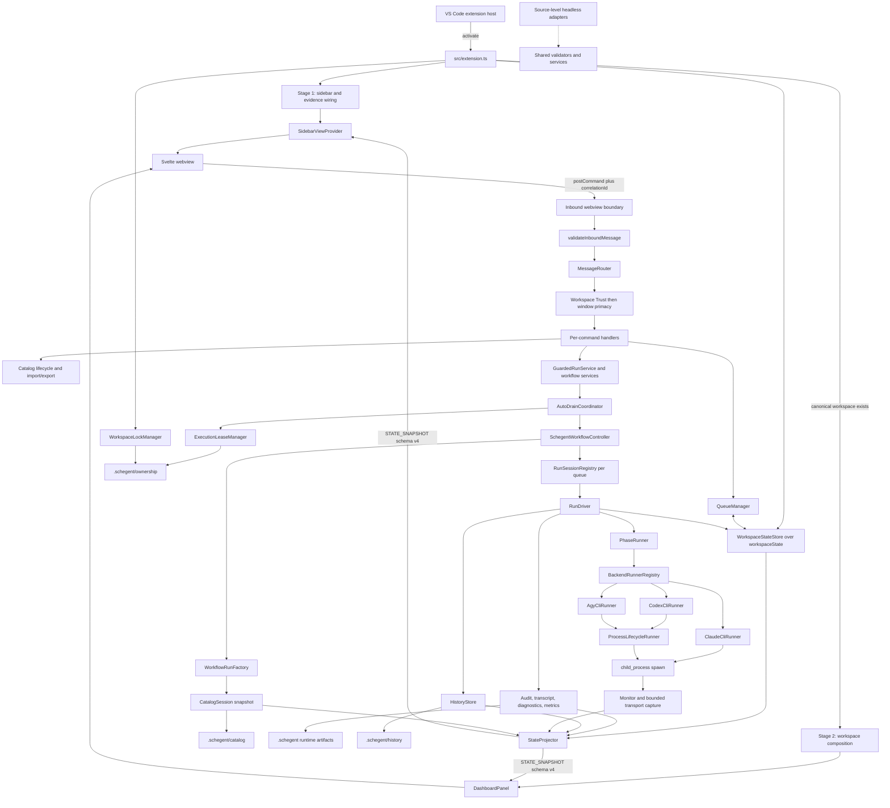

# Architecture

Schegent is a local-first VS Code extension, not a client for a Schegent server. One CommonJS extension bundle activates inside the VS Code extension host, renders Svelte webviews, validates their messages, coordinates workspace-local Queues and Runs, and launches one of three external CLI backends. The persistence edge is VS Code `workspaceState` plus local filesystem artifacts; the repository contains no database, ORM, HTTP server, REST or GraphQL router, or database migration layer.

<!-- Source: package.json -->
<!-- Source: esbuild.config.mjs -->
<!-- Source: src/extension.ts -->
<!-- Source: src/state/workspace-state.ts -->

The only image assets found in `assets/` are the project logo, banner, and sidebar icon. None is an architecture diagram, so this page uses a source-derived Mermaid topology instead of relabelling a branding asset as a system diagram.

<!-- Source: assets/logo.png -->
<!-- Source: assets/banner.png -->
<!-- Source: assets/sidebar-icon.svg -->

## Topology

<!-- Source: src/extension.ts -->
<!-- Source: src/ui/sidebar/sidebar-view-provider.ts -->
<!-- Source: src/ui/dashboard/dashboard-panel.ts -->
<!-- Source: src/ui/sidebar/message-router.ts -->
<!-- Source: src/services/auto-drain-coordinator.ts -->
<!-- Source: src/controller/workflow-controller.ts -->
<!-- Source: src/services/workflow-run-factory.ts -->
<!-- Source: src/services/run-driver.ts -->
<!-- Source: src/controller/phase-runner.ts -->
<!-- Source: src/runner/backend-runner-registry.ts -->
<!-- Source: src/ui/sidebar/state-projector-runtime.ts -->

## Activation has two stages

Stage 1 is deliberately workspace-independent. `activate()` creates centralized sanitized logging and evidence-health wiring, registers the sidebar with a placeholder projector, and wraps `context.workspaceState` in `WorkspaceStateStore`. The sidebar can therefore explain “no workspace” or “initialization failed” instead of disappearing. The Reset command is registered at this level because it must be able to tear down and reconstruct whichever Stage 2 instance is current.

<!-- Source: src/extension.ts -->
<!-- Source: src/ui/sidebar/placeholder-projector.ts -->

Stage 2 begins only when a canonical workspace folder exists. The first folder in a multi-root window is canonical. Composition initializes and migrates state, validates effective settings, opens one catalog snapshot, switches ownership to filesystem-backed fencing records, creates the Queue, audit, runner, controller, projector, dashboard, and command services, then installs the real sidebar dispatcher. Removing the last workspace folder disposes Stage 2 and reinstalls the placeholder.

<!-- Source: src/extension.ts -->
<!-- Source: src/state/workspace-folder-picker.ts -->
<!-- Source: src/state/ownership-fs.ts -->
<!-- Source: src/state/ownership-registry.ts -->

Initialization failures do not partially expose workspace operations. `WorkspaceStateStore.initialize()` completes forward migrations first; a failure replaces the projector with an `init-failed` placeholder and Stage 2 construction returns without registering its operational services.

<!-- Source: src/extension.ts -->
<!-- Source: src/state/workspace-state.ts -->

## The request boundary

The Svelte webview obtains VS Code's API once and sends command envelopes containing a type, correlation ID, and payload. `SidebarViewProvider` treats received values as `unknown`; `validateInboundMessage` checks the envelope and command-specific payload before any dispatch. Invalid data is logged at debug level and dropped. The webview cannot import host services directly.

<!-- Source: webview-ui/src/lib/vscode-api.ts -->
<!-- Source: src/ui/sidebar/sidebar-view-provider.ts -->
<!-- Source: src/contracts/runtime-validators.ts -->

`MessageRouter` then applies policy in a fixed order. A mutating command is first refused when Workspace Trust is absent, and then refused when this window is not the primary owner. Only after both gates does the router select a handler. Read-only commands do not acquire mutation authority merely because they share the same router.

<!-- Source: src/ui/sidebar/message-router.ts -->
<!-- Source: src/contracts/sidebar-command-metadata.ts -->
<!-- Source: src/ui/sidebar/commands/primacy-gate.ts -->

Handlers are thin adapters around owned services. They validate operation-specific conditions, acknowledge with the original correlation ID, and call catalog, Queue, Run, settings, history, metrics, or diagnostic operations. VS Code command-palette commands enter many of the same services from the host side; Schegent exposes no HTTP endpoint and declares no `bin` executable.

<!-- Source: src/ui/sidebar/commands/index.ts -->
<!-- Source: src/activation/ui-wiring.ts -->
<!-- Source: package.json -->

## From a pending Task to a running subprocess

Queue admission is intentionally separate from execution. `AutoDrainCoordinator` evaluates one pending head through a seven-step sequence:

1. An `idle-pending` Queue waits for its scheduled or explicit start.
2. An operator-paused Queue remains paused.
3. The Queue must have neither an in-flight Task nor a non-terminal Run occupying its one Run slot.
4. Both the controller's live-session count and the workspace's persisted in-flight count must be below the workspace-wide concurrency cap. Both readings take that number from the same place — the `schegent.queue.globalConcurrencyCap` entry in workspace state, set through the Queue configuration surface rather than in `settings.json`.
5. The selected Task is the Queue's FIFO pending head.
6. The host acquires and re-verifies that Queue's execution lease.
7. The controller resumes the matching persisted Run or admits a new one.

Each refusal before admission is a wait, not a failed Task. Reservations cover the interval between the capacity decision and observable admission so concurrent drains cannot spend the same slot.

<!-- Source: src/services/auto-drain-coordinator.ts -->
<!-- Source: src/queue/queue-manager.ts -->
<!-- Source: src/state/execution-lease.ts -->
<!-- Source: src/state/workspace-state.ts -->

For a new admission, `WorkflowRunFactory` resolves the selected Pipeline against the single `CatalogSession` snapshot. It refuses a missing Pipeline or Phase instead of shortening the plan. A composed Task may already carry a frozen `ExecutionEnvelope`; otherwise the factory expands and freezes the Pipeline, all Phase bodies, the mutation plan, approval receipt, transcript mode, progress denominator, inputs, and default runner into a new `WorkflowRun`. Later catalog or setting changes cannot rewrite that Run's plan.

<!-- Source: src/services/workflow-run-factory.ts -->
<!-- Source: src/activation/catalog-loading.ts -->
<!-- Source: src/config/pipeline-snapshot.ts -->
<!-- Source: src/contracts/run-request.ts -->

The controller persists the Run under its Queue key and marks the Task in flight before returning admission. A `RunSessionRegistry` owns one driver session per Queue, which permits several Queues to run concurrently while preserving the one-Run-per-Queue rule. A paused Run retains its session, cap slot, and execution lease; terminal cleanup removes only its own session.

<!-- Source: src/controller/workflow-controller.ts -->
<!-- Source: src/controller/run-session.ts -->
<!-- Source: src/contracts/state-schema.ts -->

`RunDriver` executes the frozen Phase sequence. Before the first Phase it probes every distinct backend referenced by the plan. For each Phase it applies current per-Run controls, verifies mutation approval where required, captures a recovery checkpoint before Git-capable work, resolves continuation/session reuse, and asks `PhaseRunner` to invoke the chosen adapter. It then persists the decision to advance, retry, pause, fail, cancel, or complete and records audit/history evidence at the owning boundary.

<!-- Source: src/services/run-driver.ts -->
<!-- Source: src/services/run-checkpoint-service.ts -->
<!-- Source: src/controller/phase-runner.ts -->

The backend registry lazily constructs and caches adapters for `claude`, `codex`, and `agy`. Claude owns its stream-json harness; Codex and Agy share `ProcessLifecycleRunner`. Every spawn uses `shell: false`, receives its prompt over stdin, bounds retained stdout/stderr, observes timeout and cancellation, and escalates TERM to KILL after the grace period. Retry policy remains above the adapter layer.

<!-- Source: src/runner/backend-runner-registry.ts -->
<!-- Source: src/runner/claude-cli.ts -->
<!-- Source: src/runner/codex-cli.ts -->
<!-- Source: src/runner/agy-cli.ts -->
<!-- Source: src/runner/process-lifecycle-runner.ts -->
<!-- Source: src/contracts/backend-runner.ts -->

## Evidence and projection flow back to the UI

The host keeps raw process output away from the webview boundary. `PhaseRunner`, monitor, and driver feed dedicated sinks: structured audit, raw transcript policy, per-Phase diagnostics, sanitized runtime logging, bounded transport capture, terminal history, and metrics rollup. These sinks have distinct redaction and retention contracts; the structured audit path uses projected typed payloads rather than arbitrary output strings.

<!-- Source: src/controller/phase-runner.ts -->
<!-- Source: src/audit/audit-payload.ts -->
<!-- Source: src/audit/raw-transcript-writer.ts -->
<!-- Source: src/monitor/cli-transport-sink.ts -->
<!-- Source: src/services/history-recorder.ts -->
<!-- Source: src/metrics/metrics-rollup-writer.ts -->

`StateProjector` subscribes to Memento changes, audit appends, monitor samples, and history updates. It composes immutable `WorkflowSnapshot` schema v4 and publishes it through the sidebar and dashboard providers. The webview rejects another snapshot version instead of guessing its shape. This feedback loop makes the UI a projection of host-owned state rather than a second state machine.

<!-- Source: src/ui/sidebar/state-projector-runtime.ts -->
<!-- Source: src/ui/sidebar/snapshot.ts -->
<!-- Source: webview-ui/src/lib/snapshot-store.svelte.ts -->
<!-- Source: src/ui/sidebar/sidebar-view-provider.ts -->
<!-- Source: src/ui/dashboard/dashboard-panel.ts -->

## Persistence, not a database layer

`WorkspaceStateStore` is the durable structured-state adapter. Its numeric schema is forward-only and currently version 13. The principal records are Queues, active Runs partitioned by Queue, terminal history partitioned by Queue, connected Workflow Runs, lock/lease mirrors, watchdog state, confirmation suppressions, and migration/reset markers. Migrations transform Memento values in sequence; there is no down migration and no relational schema.

<!-- Source: src/contracts/state-schema.ts -->
<!-- Source: src/state/workspace-state.ts -->
<!-- Source: src/state/queue-state-migrator.ts -->
<!-- Source: src/state/run-state-migrator.ts -->
<!-- Source: src/state/history-state-migrator.ts -->

Filesystem storage owns data with different integrity or retention needs: immutable catalog versions under `.schegent/catalog`, authoritative fencing under `.schegent/ownership`, structured audit and session evidence, full rerun descriptions under `.schegent/history`, cumulative metrics, and transport/runtime logs. Private pre-Git recovery checkpoints live under extension `globalStorage`, outside the repository they recover. See [File layout](../reference/file-layout.md) for exact paths.

<!-- Source: src/host-services/catalog-fs-adapter.ts -->
<!-- Source: src/state/ownership-fs.ts -->
<!-- Source: src/audit/audit-log-writer.ts -->
<!-- Source: src/services/history/history-description-store.ts -->
<!-- Source: src/services/run-checkpoint-service.ts -->

## Concurrency boundaries

Window primacy and execution exclusion answer different questions. `WorkspaceLockManager` elects one mutating extension window for the workspace from activation until disposal. `ExecutionLeaseManager` fences one executor per Queue, allowing independent Queues to run in parallel. Both use filesystem-backed generation records with 5-second heartbeats and 15-second staleness; disk is authoritative, while Memento data is not relied on for cross-process exclusion.

<!-- Source: src/state/lock.ts -->
<!-- Source: src/state/execution-lease.ts -->
<!-- Source: src/state/ownership-registry.ts -->
<!-- Source: src/state/ownership-fs.ts -->

The workspace concurrency setting defaults to `1` and accepts `1` through `20`; each Queue still holds at most one Run. Parallel Runs share the same checkout, so the cap is capacity control rather than file isolation or rollback.

<!-- Source: package.json -->
<!-- Source: src/queue/queue-registry.ts -->
<!-- Source: src/services/auto-drain-coordinator.ts -->

## Headless source adapters and explicit absences

Modules under `src/headless/` expose source-level, VS Code-free adapters for shared validators and services. They are useful to tests and internal consumers, but `package.json` declares neither an `exports` map nor a second bundle entry, so they are not a published library API or a Schegent CLI.

<!-- Source: src/headless/process-definition-api.ts -->
<!-- Source: src/headless/process-yaml-api.ts -->
<!-- Source: src/headless/pipeline-run-api.ts -->
<!-- Source: src/headless/workflow-run-api.ts -->
<!-- Source: package.json -->
<!-- Source: esbuild.config.mjs -->

No `User`, `Account`, `Organization`, or `Tenant` entity and no authentication subsystem exists in this repository. Local authorization consists of VS Code Workspace Trust, primary-window ownership, per-Queue leases, explicit Git mutation consent, and backend runner policy. Remote multi-user execution would require a separate expansion architecture gate rather than an inference from the current local design.

<!-- Source: src/ui/sidebar/message-router.ts -->
<!-- Source: src/state/lock.ts -->
<!-- Source: src/state/execution-lease.ts -->
<!-- Source: src/activation/git-approval.ts -->

Schegent also ships no built-in Phase, Pipeline, or Workflow definitions. An empty effective catalog is valid. Workflow connections describe mutually exclusive branches rather than a parallel fan-out marker, and conditions use structured operands plus a closed operator set rather than a free-text evaluator.

<!-- Source: src/config/pipeline-config.ts -->
<!-- Source: src/contracts/workflow-definitions.ts -->
<!-- Source: src/services/workflow-execution/condition-evaluator.ts -->
