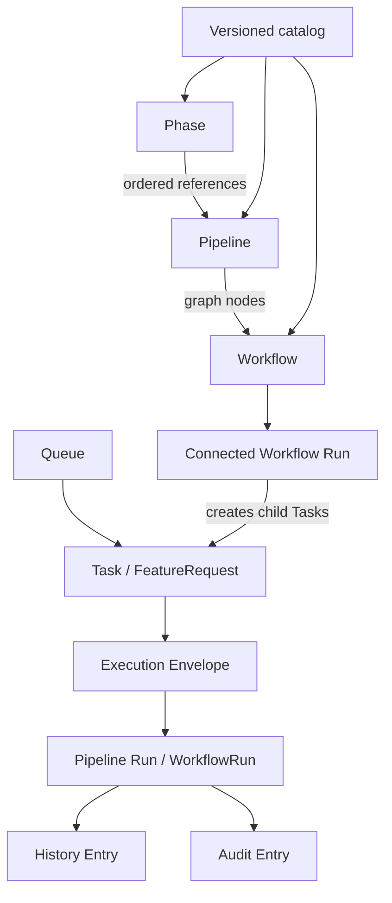

# Core concepts

Schegent is a local VS Code extension for turning an operator request into a queued, evidence-bearing run of one or more backend CLI invocations. Its domain model is expressed in TypeScript contracts and persisted through VS Code Memento plus workspace-local files; there is no database, account system, `User`, `Tenant`, or `Organization` entity. In this documentation, a **Workspace** is the canonical local folder that owns Schegent state.

<!-- Source: src/extension.ts -->
<!-- Source: src/state/workspace-state.ts -->
<!-- Source: src/state/workspace-folder-picker.ts -->

## The model at a glance

Schegent separates reusable authored definitions from one-time execution records:

<!-- Source: src/contracts/process-definitions.ts -->
<!-- Source: src/contracts/pipeline-definitions.ts -->
<!-- Source: src/contracts/workflow-definitions.ts -->
<!-- Source: src/queue/feature-request.ts -->
<!-- Source: src/state/workflow-run.ts -->
<!-- Source: src/state/connected-workflow-run.ts -->
<!-- Source: src/state/history-entry.ts -->

The main nouns are:

| Concept | Meaning |
|---|---|
| **Phase** | The smallest authored unit of backend work. |
| **Pipeline** | An ordered program of Phase occurrences with typed inputs, outputs, and bindings. |
| **Workflow** | An acyclic graph of Pipeline nodes and conditional connections. |
| **Catalog version** | An immutable stored body for one Phase, Pipeline, or Workflow. |
| **Queue** | An ordered local collection of Tasks with at most one in-flight Task. |
| **Task** | The UI name for the host's `FeatureRequest`: a request waiting, running, paused, or terminal in a Queue. |
| **Execution Envelope** | The immutable plan produced by validating and freezing a `RunRequest`. |
| **Pipeline Run** | One execution of a frozen Pipeline. The host type retains the historical name `WorkflowRun`. |
| **Connected Workflow Run** | The aggregate that coordinates child Pipeline Runs across a frozen Workflow graph. |
| **History Entry** | A terminal summary of a Pipeline Run. |
| **Audit Entry** | Typed evidence for a host-observed lifecycle event. |

<!-- Source: src/contracts/catalog-store.ts -->
<!-- Source: src/contracts/run-request.ts -->
<!-- Source: src/state/workflow-run.ts -->
<!-- Source: src/contracts/audit-events.ts -->

## Phase: one unit of backend work

A `PhaseDefinition` has a stable `phaseId`, display name, authored numeric version, and exactly one execution form: either an `instruction` string or a `skill` name. Optional fields select a backend runner, model, effort, timeout, loop and retry behavior, evidence policy, and declared side effects. The valid runner kinds are `claude`, `codex`, and `agy`.

<!-- Source: src/contracts/process-definitions.ts -->
<!-- Source: src/config/process-definition-validator.ts -->

The `sideEffects` values are `none`, `workspace`, `git`, and `unrestricted`. This declaration selects planning, operator-consent, and rollback behavior; it is not an operating-system sandbox. A Git-writing declaration is refused when the chosen runner cannot write Git state. Evidence policy is independently `required`, `best-effort`, or `none`.

<!-- Source: src/contracts/process-definitions.ts -->
<!-- Source: src/config/phase-runner-policy.ts -->
<!-- Source: src/services/mutation-plan.ts -->

The distinction matters: a Phase describes one reusable operation, not one invocation. Runtime progress, retries, results, and backend session IDs belong to a Run.

## Pipeline: an ordered program

A `PipelineDefinition` names a nonempty ordered list of Phase IDs. The same Phase may occur more than once, so bindings address a `phaseIndex` rather than assuming each ID is unique. A Pipeline also declares typed input and output ports, bindings between those ports and Phase positions, optional execution defaults, and advisory `recommendedNext` Pipeline IDs.

<!-- Source: src/contracts/pipeline-definitions.ts -->
<!-- Source: src/config/pipeline-definition-validator.ts -->

Inputs use the closed types `text`, `source`, `source-list`, `local-file`, `local-folder`, `web-url`, `pipeline-output`, and `repository-context`. Outputs use `markdown`, `file`, `file-set`, `structured-data`, `run-request`, and `external-reference`. A Phase-output binding points backward to an earlier Phase occurrence; Schegent does not coerce incompatible port types.

<!-- Source: src/contracts/pipeline-definitions.ts -->
<!-- Source: src/config/pipeline-binding-validator.ts -->

A Pipeline is still a definition. It becomes executable only after publication, request validation, and freezing into an Execution Envelope.

## Workflow: a graph of Pipelines

A `WorkflowDefinition` is a reusable directed acyclic graph. Each node has a stable `nodeId` and references a `pipelineId`; several nodes may reference the same Pipeline. Connections join one node output to another node input. The graph has one or more start nodes, every node must be reachable from a start, and cycles are invalid.

<!-- Source: src/contracts/workflow-definitions.ts -->
<!-- Source: src/config/workflow-definition-validator.ts -->
<!-- Source: src/config/workflow-graph-validator.ts -->

Several outgoing connections are ordered alternatives, not a request to run all branches in parallel. A connection may carry a structured condition, priority, default marker, or collection-selection rule. Conditions use a closed operator set and data operands; they are not executable text. Workflow-level ports are derived from the node ports left unconnected rather than stored separately.

<!-- Source: src/contracts/workflow-definitions.ts -->
<!-- Source: src/config/workflow-graph-validator.ts -->

Do not confuse **Workflow** with the host type `WorkflowRun`. Workflow is the authored graph. `WorkflowRun` is the older internal name for one Pipeline Run. A whole graph in progress is a `ConnectedWorkflowRun`.

<!-- Source: src/contracts/workflow-definitions.ts -->
<!-- Source: src/state/workflow-run.ts -->
<!-- Source: src/state/connected-workflow-run.ts -->

## Catalog versions and lifecycle

The catalog stores exactly three definition kinds: `phase`, `pipeline`, and `workflow`. Every saved body is an immutable `CatalogVersionRecord` such as `v3`. A mutable `CatalogManifestEntry` lists versions oldest first and points separately to the current draft and active version. The store retains up to 50 versions per definition.

<!-- Source: src/contracts/catalog-store.ts -->
<!-- Source: src/catalog/catalog-paths.ts -->

Those two pointers produce three visible lifecycle states:

- **draft**: a draft exists and no active version exists;
- **active**: an active version exists and no draft exists;
- **active with draft**: both exist and identify different versions.

Only active bodies enter the effective catalogs used to start work. Saving a draft does not change running behavior; publishing moves the draft into the active position. Deactivation removes the active pointer, restore creates a new draft from an older body, and discard removes the pending draft. Lifecycle writes use an expected-draft token so a stale editor cannot silently replace a concurrent change.

<!-- Source: src/contracts/catalog-lifecycle.ts -->
<!-- Source: src/catalog/catalog-manifest.ts -->
<!-- Source: src/config/process-catalog.ts -->
<!-- Source: src/config/pipeline-catalog.ts -->
<!-- Source: src/config/workflow-catalog.ts -->

Schegent ships with an empty definition catalog. An operator must import or author and publish definitions before selecting a Pipeline.

<!-- Source: src/config/pipeline-config.ts -->

## Queue and Task

A Queue has a registry identity, human-readable name, position, timestamps, and optional one-shot schedule. There are between 1 and 20 Queue records, including the reserved `default` Queue. Queue state owns the ordered Task list, at most one `inFlightId`, lifecycle information, and pause attribution.

<!-- Source: src/queue/queue-registry.ts -->
<!-- Source: src/queue/feature-request.ts -->

The product calls each row a **Task**; host code calls it `FeatureRequest`. Its status is one of `pending`, `in-flight`, `paused`, `completed`, `canceled`, or `failed`. It carries the description, Queue position, timestamps, optional Pipeline and Run identities, and retry, failure, pause, and rerun metadata. `completed`, `canceled`, and `failed` are terminal Task states.

<!-- Source: src/queue/feature-request.ts -->
<!-- Source: src/queue/queue-manager.ts -->

Queue and Run are distinct. The Queue answers what should start next and whether a slot is occupied. The Run answers what has already been frozen and how far execution has progressed.

## From request to immutable execution

A `RunRequest` is a transient composition request: it names a Pipeline, supplies typed inputs and supplemental material, maps declared outputs to targets, and may add instructions. It has no durable identity and is not itself inserted into a Queue.

<!-- Source: src/contracts/run-request.ts -->

Validation resolves that request against the active catalog and produces an `ExecutionEnvelope`, also called `FrozenRunPlan`. The envelope captures the concrete Pipeline and Phase definitions, bindings, declared effects, policy decisions, outputs, and provenance. A Task created through the composer can carry this frozen plan so later catalog edits do not change what it will execute.

<!-- Source: src/services/run-request/run-request-validator.ts -->
<!-- Source: src/contracts/run-request.ts -->
<!-- Source: src/queue/feature-request.ts -->

The Pipeline Run host record is `WorkflowRun`. It references its Task through `featureId` and freezes the expanded Pipeline snapshot. It tracks status, current Phase, completed Phase results, sanitized failure information, retry timing, manual pauses, breakpoints, per-Run Phase overrides, backend session identity, activity time, mutation approval, and resolved outputs.

<!-- Source: src/state/workflow-run.ts -->

Run statuses are `running`, `paused`, `failed`, `completed`, and `canceled`. A failed Run is terminal for automatic cleanup but remains eligible for explicit operator controls; a paused Run is nonterminal and keeps its Queue slot.

<!-- Source: src/state/workflow-run.ts -->
<!-- Source: src/controller/run-session.ts -->

## Connected Workflow Run

A `ConnectedWorkflowRun` coordinates a Workflow graph without merging its child Pipeline Runs into one giant record. It freezes the graph and member Pipeline snapshots, records node attempts and routing decisions, and refers to each child by its queued Task ID. Child status, current Phase, log bodies, and output contents remain on the child records.

<!-- Source: src/state/connected-workflow-run.ts -->

The aggregate has a positive monotonic revision for compare-and-set updates. It has no aggregate status field. Each completed node decision can choose the next eligible connection, and continuation creates the next child Task against the frozen plan.

<!-- Source: src/state/connected-workflow-run.ts -->
<!-- Source: src/services/workflow-execution/continuation-service.ts -->

## History and evidence

A `HistoryEntry` is a terminal projection of a Pipeline Run. It records Run and Task IDs, terminal status and timing, Pipeline and catalog provenance when known, output records, an error summary, and an audit pointer. The Queue association is supplied by the history partition rather than duplicated on the entry.

<!-- Source: src/state/history-entry.ts -->
<!-- Source: src/contracts/state-schema.ts -->

The full sanitized Task description is stored separately in `.schegent/history/<runId>.txt`; the Memento entry keeps a bounded preview and a relative reference after the file write succeeds. This supports byte-identical reruns without repeatedly serializing large descriptions into state.

<!-- Source: src/services/history/history-description-store.ts -->
<!-- Source: src/state/history-entry.ts -->

An `AuditEntry` is typed metadata about a host-observed event. It is useful lifecycle evidence, but it is not a complete backend transcript and does not prove that a local operator or backend process left the file unchanged.

<!-- Source: src/audit/audit-entry.ts -->
<!-- Source: src/contracts/audit-events.ts -->
<!-- Source: src/audit/audit-payload.ts -->
<!-- Source: src/audit/audit-log-writer.ts -->

## Local ownership, not user identity

Schegent has no application-level users or roles. Instead, local ownership records coordinate processes: window primacy chooses the VS Code host allowed to mutate shared workspace state, and an execution lease chooses the executor for a Queue. These records fence concurrent local actors; they are not authentication identities and do not create a remote multi-user model.

<!-- Source: src/state/ownership-registry.ts -->
<!-- Source: src/state/execution-lease.ts -->
<!-- Source: src/ui/sidebar/commands/primacy-gate.ts -->

That local-first boundary explains the hierarchy: authored definitions describe reusable work; Tasks schedule intent; immutable plans preserve meaning; Runs record execution; and History plus Audit preserve what the host observed.
