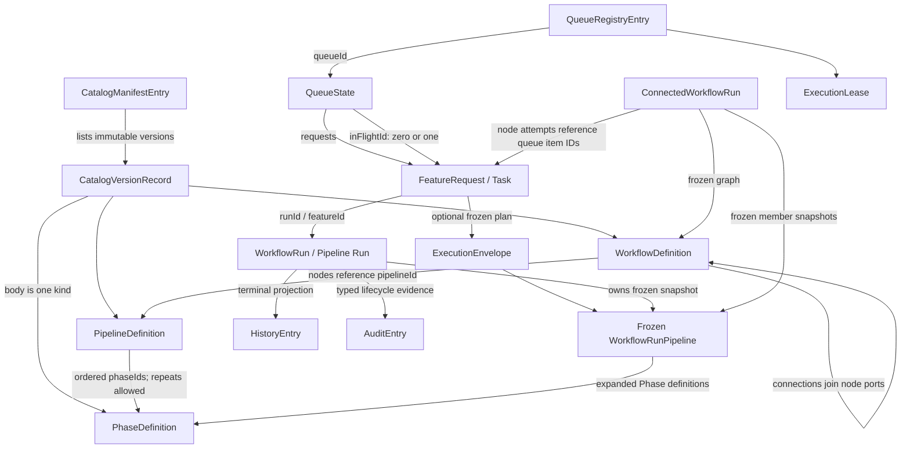

# Domain model

Schegent's domain model is declared in TypeScript contracts and persisted through VS Code Memento plus local files. There is no Database/ORM schema to extract: the repository contains no `User`, `Workspace`, `Tenant`, `Account`, or `Organization` entity and no Schegent login model. “Workspace” means the canonical local VS Code folder that owns `.schegent/` state, not a database row.

<!-- Source: src/contracts/process-definitions.ts -->
<!-- Source: src/contracts/pipeline-definitions.ts -->
<!-- Source: src/contracts/workflow-definitions.ts -->
<!-- Source: src/state/workspace-state.ts -->
<!-- Source: src/state/workspace-folder-picker.ts -->

The exact product nouns are Phase, Pipeline, Workflow, Definition version, Catalog lifecycle, Queue, Task (`FeatureRequest` in host code), Run (`WorkflowRun` in host code), Execution Envelope, Connected Workflow Run, History Entry, Audit Entry, Ownership Record, and Execution Lease. “Workflow” and `WorkflowRun` are intentionally different concepts: the first is a reusable graph of Pipelines; the second is one executing Pipeline snapshot.

<!-- Source: src/contracts/workflow-definitions.ts -->
<!-- Source: src/state/workflow-run.ts -->
<!-- Source: src/state/connected-workflow-run.ts -->

## Relationship map

<!-- Source: src/contracts/catalog-store.ts -->
<!-- Source: src/contracts/process-definitions.ts -->
<!-- Source: src/contracts/pipeline-definitions.ts -->
<!-- Source: src/contracts/workflow-definitions.ts -->
<!-- Source: src/queue/feature-request.ts -->
<!-- Source: src/state/workflow-run.ts -->
<!-- Source: src/state/connected-workflow-run.ts -->
<!-- Source: src/state/history-entry.ts -->

## Authored definitions

### Phase

A `PhaseDefinition` is the smallest authored unit of work. Its stable identity is `phaseId`; its body is a discriminated union containing exactly one of `instruction` or `skill`. It also carries a display name, numeric authored version, and optional description, runner, model, effort, timeout, loop/retry controls, evidence policy, and `sideEffects` declaration. Unknown fields and a body containing both or neither execution forms are invalid.

<!-- Source: src/contracts/process-definitions.ts -->
<!-- Source: src/config/process-definition-validator.ts -->

Phase IDs match `^[a-z][a-z0-9-]{0,63}$`. Names are 1–80 characters, descriptions at most 1,024, instructions 1–8,192, skills 1–256, and `retryCondition` at most 512. Timeouts are whole seconds from 1 through 3,600. Runners are `claude`, `codex`, or `agy`; effort is `low`, `medium`, `high`, `xhigh`, or `max`, although Agy rejects the two highest effort values.

<!-- Source: src/config/process-definition-validator.ts -->
<!-- Source: src/contracts/process-definitions.ts -->

The `sideEffects` values are `none`, `workspace`, `git`, and `unrestricted`; the evidence policies are `required`, `best-effort`, and `none`. The former selects a mutation plan, consent, and rollback behavior. A Git-writing declaration is refused on a runner that is not Git-capable; the field does not constrain the spawned process.

<!-- Source: src/contracts/process-definitions.ts -->
<!-- Source: src/config/phase-runner-policy.ts -->
<!-- Source: src/services/mutation-plan.ts -->

### Pipeline

A `PipelineDefinition` is a reusable ordered program of Phase references. `phaseIds` must be nonempty and may repeat a Phase, so every `PhaseBinding` addresses `phaseIndex` rather than assuming a Phase ID occurs once. The definition owns declared input/output ports, bindings, advisory execution defaults, and `recommendedNext` Pipeline IDs.

<!-- Source: src/contracts/pipeline-definitions.ts -->
<!-- Source: src/config/pipeline-definition-validator.ts -->

Input types are `text`, `source`, `source-list`, `local-file`, `local-folder`, `web-url`, `pipeline-output`, and `repository-context`. Output types are `markdown`, `file`, `file-set`, `structured-data`, `run-request`, and `external-reference`. Port IDs are unique within their input or output namespace. A Phase-output binding must point strictly backward to a Phase position that declares the named output, and `pipeline-output` is the only Phase-to-Phase input bridge. No binding coercion layer exists.

<!-- Source: src/contracts/pipeline-definitions.ts -->
<!-- Source: src/config/pipeline-binding-validator.ts -->

`recommendedNext` is advisory. An unresolved recommended Pipeline produces a warning but does not invalidate the definition or alter execution.

<!-- Source: src/config/pipeline-catalog.ts -->

### Workflow

A `WorkflowDefinition` is a reusable acyclic graph whose nodes reference Pipelines. Node IDs are stable within the graph, are unique, and allow several nodes to reference the same Pipeline. Connections have no independent ID; each connects one node/output port to another node/input port. `startNodeIds` is nonempty, every node must be reachable from a start, and a cycle is invalid.

<!-- Source: src/contracts/workflow-definitions.ts -->
<!-- Source: src/config/workflow-definition-validator.ts -->
<!-- Source: src/config/workflow-graph-validator.ts -->

Each destination input accepts one producer. Multiple outgoing connections from one output are conditional alternatives, not a parallel fan-out marker; at most one may be the default branch. Collection outputs require `first`, `last`, or `exactlyOne` when feeding a scalar destination.

<!-- Source: src/config/workflow-graph-validator.ts -->
<!-- Source: src/contracts/workflow-definitions.ts -->

The compatibility matrix is fixed: `markdown` feeds `text` or `source`; `file` feeds `local-file` or `source`; `file-set` feeds `local-folder` or `source-list`; `structured-data` and `run-request` feed `pipeline-output`; and `external-reference` feeds `web-url` or `source`.

<!-- Source: src/config/workflow-graph-validator.ts -->

Conditions are structured data, never free-text expressions. The closed operator set is `equals`, `notEquals`, `in`, `exists`, `greaterThan`, `greaterThanOrEqual`, `lessThan`, and `lessThanOrEqual`. Operands may read the source node or an ancestor, and node-status comparisons accept only `completed`, `failed`, or `canceled`. Workflow-level input/output ports are derived from unbound node ports and are not stored as another representation.

<!-- Source: src/contracts/workflow-definitions.ts -->
<!-- Source: src/config/workflow-graph-validator.ts -->

## Versioned catalog and lifecycle

The catalog owns exactly three kinds: `phase`, `pipeline`, and `workflow`. `CatalogVersionRecord` stores one immutable authored body under an identity such as `v3`; `CatalogManifestEntry` stores the monotonic oldest-first version list plus `draftVersionId` and `activeVersionId`. Up to 50 versions are retained per definition. The manifest is store format v1 and is the catalog's only mutable file.

<!-- Source: src/contracts/catalog-store.ts -->
<!-- Source: src/catalog/catalog-paths.ts -->

Lifecycle state is derived exclusively from those two pointers:

- `draft`: a draft exists and no active version exists.
- `active`: an active version exists and no draft exists.
- `active-with-draft`: both exist and identify different versions.

Neither pointer means the manifest entry must not exist; there is no fourth lifecycle state. Only active bodies enter effective catalogs, so a draft cannot execute or satisfy an active downstream reference.

<!-- Source: src/contracts/catalog-lifecycle.ts -->
<!-- Source: src/config/process-catalog.ts -->
<!-- Source: src/config/pipeline-catalog.ts -->
<!-- Source: src/config/workflow-catalog.ts -->

Save-draft, publish, restore, deactivate, and discard-draft operations use the expected draft token as a compare-and-set boundary. Direct active dependencies block deactivation: an active Pipeline blocks its Phase, and an active Workflow blocks its Pipeline. Draft references and a configured default are advisories. Schegent ships no definition records; an absent manifest resolves as a healthy empty catalog.

<!-- Source: src/contracts/catalog-lifecycle.ts -->
<!-- Source: src/catalog/catalog-manifest.ts -->
<!-- Source: src/config/pipeline-config.ts -->

## Queue and Task

A `QueueRegistryEntry` gives a Queue its identity, name, ordering position, optional one-shot schedule, and timestamps. A registry contains 1–20 entries, always includes the reserved `default` ID, accepts UUIDv4 for other IDs, requires case-insensitively unique trimmed names of 1–64 characters, and keeps positions unique and contiguous from zero. Pause truth is not persisted on this entry; it is projected from the Queue's state.

<!-- Source: src/queue/queue-registry.ts -->

`QueueState` owns an ordered `requests` array, at most one `inFlightId`, lifecycle and pause attribution, and optional scheduled-start fields. Its lifecycle is `active-empty`, `idle-pending`, `running`, or `operator-paused`. `queueLifecycle` is the authoritative pause value; the deprecated `paused` field is migration input only.

<!-- Source: src/queue/feature-request.ts -->
<!-- Source: src/contracts/state-schema.ts -->

The UI noun Task is the host type `FeatureRequest`. A Task contains a bounded description, Queue association, position and timestamps, status, optional Pipeline ID, Run ID, retry/failure/pause information, and optional rerun provenance. A Queue accepts at most 100 pending Tasks and descriptions are nonempty after trimming and at most 32,000 characters.

<!-- Source: src/queue/feature-request.ts -->
<!-- Source: src/queue/queue-manager.ts -->

Task statuses are `pending`, `in-flight`, `paused`, `completed`, `canceled`, and `failed`; only the last three are terminal. A Task submitted through the composer may additionally carry `runPlan`, the immutable plan resolved at submission. Ordinary and legacy Tasks carry no plan and resolve against the effective catalog when admitted.

<!-- Source: src/queue/feature-request.ts -->
<!-- Source: src/contracts/run-request.ts -->

## Execution Envelope and Pipeline Run

`RunRequest` is a transient, identity-free request to compose execution. It is never itself persisted or placed in a Queue. Successful validation resolves it into an immutable `ExecutionEnvelope`, also named `FrozenRunPlan`, which captures a frozen Pipeline, input bindings, declared effects, policy decisions, and provenance. Persisted Tasks and Runs carry that result, not the mutable request.

<!-- Source: src/contracts/run-request.ts -->
<!-- Source: src/services/run-request/run-request-validator.ts -->

`WorkflowRun` is the host's historical name for one executing Pipeline Run. `featureId` references its Task. It intentionally carries no `queueId`: the `schegent.run` Memento record is keyed by Queue ID, making the map key the only association. The Run freezes `WorkflowRunPipeline`, which expands the Pipeline to concrete Phase definitions and retains the ports, bindings, defaults, recommendations, and published catalog version when known.

<!-- Source: src/state/workflow-run.ts -->
<!-- Source: src/contracts/state-schema.ts -->

Run statuses are `running`, `paused`, `failed`, `completed`, and `canceled`. Completed, failed, and canceled are terminal for session and lease cleanup, but a failed Run remains operator-controllable through retry or skip controls; only completed and canceled are uncontrollable. Paused state is nonterminal and retains its Queue slot.

<!-- Source: src/state/workflow-run.ts -->
<!-- Source: src/controller/run-session.ts -->

The Run also owns progress, completed Phase results, sanitized failure data, retry timing, manual-pause pairs, breakpoints, per-Run Phase overrides, transcript mode, mutation approval, backend session identity, activity timestamp, resolved outputs, and optional Workflow-member provenance. Overrides express skipped, disabled, or removed Phases without mutating the frozen Pipeline.

<!-- Source: src/state/workflow-run.ts -->

## Connected Workflow Run

`ConnectedWorkflowRun` is a separate aggregate above the Pipeline Runs created for Workflow nodes. It freezes the Workflow graph and each member Pipeline snapshot, records decisions and node attempts, and references each attempt's queued Task ID. It deliberately does not copy a child Run's lifecycle, current Phase, logs, or output body.

<!-- Source: src/state/connected-workflow-run.ts -->

Nodes are keyed by `nodeId`; attempts are ordered, nonempty once present, and append-only. The aggregate has a positive monotonic revision and is persisted with compare-and-set. Its optional legacy Queue ID defaults to `default` on read, but a present Queue ID must be known at write time. It has no aggregate status field; deleting the aggregate is the termination operation.

<!-- Source: src/state/connected-workflow-run.ts -->
<!-- Source: src/state/workspace-state.ts -->

## Terminal history, audit, and ownership

A `HistoryEntry` is the terminal projection of a Pipeline Run. It records Task and Run IDs, terminal status and timing, an audit pointer, output records, Pipeline identity, the frozen catalog version when known, and whether the Run was standalone or a Workflow member. Like active Runs, entries do not persist `queueId`; the history map partition supplies it on read.

<!-- Source: src/state/history-entry.ts -->
<!-- Source: src/contracts/state-schema.ts -->

The full sanitized Task description lives in `.schegent/history/<runId>.txt`; the Memento entry stores an 80-character preview and a workspace-relative reference only after the file write succeeds. This keeps terminal state useful when description persistence fails and bounds repeated Memento serialization.

<!-- Source: src/state/history-entry.ts -->
<!-- Source: src/services/history/history-description-store.ts -->

An `AuditEntry` is typed lifecycle evidence with schema version 3. Payload projection admits only the fields declared for that event type before the append writer serializes it. Audit is evidence of host-observed transitions; it is not the complete unredacted backend transcript.

<!-- Source: src/audit/audit-entry.ts -->
<!-- Source: src/contracts/audit-events.ts -->
<!-- Source: src/audit/audit-payload.ts -->

Ownership records are local fencing records rather than user identities. Window primacy elects one host allowed to mutate the workspace; an execution lease elects one executor for one Queue. Both carry host owner IDs, generation/fence numbers, and heartbeat timestamps. They authorize local coordination only and do not form a multi-user authentication model.

<!-- Source: src/state/ownership-registry.ts -->
<!-- Source: src/state/lock.ts -->
<!-- Source: src/state/execution-lease.ts -->
