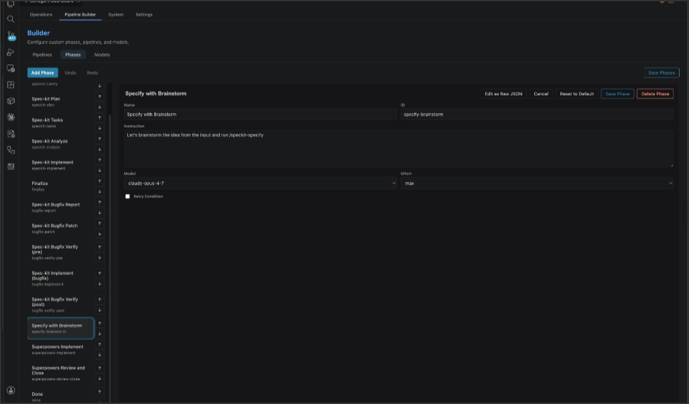
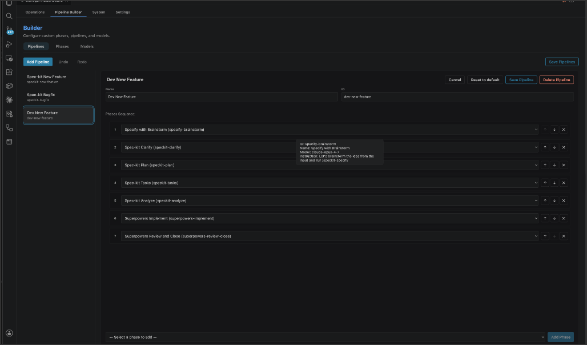

# Custom Phases and Pipelines

Beyond overriding the parameters of built-in phases, you can define entirely new phases and chain them into custom pipelines. This is how you adapt Schegent to a workflow that does not look like the Spec Driven Development workflow.

## When to define a custom phase

- You have a workflow step that does not map to any of the eight built-ins — for example, "run lint and security scans before implement".
- You have a multi-step custom flow you want to reuse across runs — a custom pipeline with its own ordering.
- You want a loop phase with a non-default exit condition (e.g., "loop until a metric is zero" rather than the default `[SCHEGENT_STATUS: CLEAR]` sentinel).

If you just want to tune a built-in's model, effort, or timeout, you do not need a custom phase — see [Phase Overrides](phase-overrides.md).

## Defining a new phase

You can define new phases visually via the **Pipeline Builder > Phases** dashboard, or manually by adding an entry to `schegent.phases` whose `id` does **not** match a built-in:



```jsonc
{
  "schegent.phases": [
    {
      "id": "lint-and-scan",
      "name": "Lint and Scan",
      "instruction": "Run the linter and security scanner. If both pass, emit [SCHEGENT_STATUS: CLEAR] on the last line of stdout. If either fails, fix the reported issues and re-run. After three iterations, emit a SCHEGENT_AUDIT_LOG block summarizing the remaining issues and exit.",
      "model": "claude-sonnet-4-6",
      "effort": "medium",
      "loopable": true
    }
  ]
}
```

Field requirements:

- `id` — kebab-case, ≤ 64 chars (`^[a-z][a-z0-9-]{0,63}$`). Cannot collide with built-in ids unless you intend to shadow.
- `name` — display name (1–80 chars).
- `instruction` — the prompt directive injected into the CLI. **For new phases this must be non-empty.** Empty strings are only accepted for shadow definitions.
- `loopable` — required boolean.

Optional fields (`model`, `effort`, `timeoutSeconds`, `retryCondition`) follow the same semantics as overrides; see [Phase Overrides](phase-overrides.md).

## Using the new phase in a pipeline

A new phase id is only useful if some pipeline references it. Define a custom pipeline visually in the **Pipelines** dashboard, or manually in your settings:



```jsonc
{
  "schegent.pipelines": [
    {
      "id": "speckit-with-security",
      "name": "Spec-kit (with lint and security)",
      "phases": [
        "speckit-specify",
        "speckit-clarify",
        "speckit-plan",
        "speckit-tasks",
        "speckit-analyze",
        "speckit-implement",
        "lint-and-scan",
        "finalize",
        "done"
      ]
    }
  ]
}
```

Pipeline rules:

- `id` — kebab-case, ≤ 64 chars. The id `speckit-new-feature` is reserved for the built-in.
- `phases` — 1 to 50 entries. Each must reference a built-in id or one of your `schegent.phases[].id`.

If a referenced id is unknown at load time, the pipeline is rejected with a warning.

## Setting the default pipeline

To make your custom pipeline the default, set:

```jsonc
{
  "schegent.defaultPipelineId": "speckit-with-security"
}
```

This sets the default selection in the enqueue dialog. You can still pick a different pipeline per task.

## Loopable phases

A phase with `loopable: true` is re-invoked until **one of two conditions** is met:

1. The phase's stdout last line equals `[SCHEGENT_STATUS: CLEAR]`. (Default exit.)
2. The configured `retryCondition` evaluates to false. (Custom exit — see below.)

Or until the iteration cap is reached (`schegent.loop.maxIterations`, default 10).

## Retry condition DSL

Loopable phases can declare a `retryCondition` expression that is evaluated against a structured metrics map the phase emitted. This lets you control the loop with a real expression instead of a hard-coded sentinel.

The host parses the phase's stdout for a `SCHEGENT AUDIT LOG` block of the form:

```text
=== SCHEGENT AUDIT LOG ===
open_questions: 3
unresolved_findings: 1
confidence: 0.78
=== END SCHEGENT AUDIT LOG ===
```

Each `<identifier>: <number>` line becomes an entry in the metrics map (the parser is whitespace-tolerant; only `<identifier>: <number>` lines are extracted). The expression in `retryCondition` is then evaluated:

```jsonc
"retryCondition": "open_questions > 0"
```

A truthy result means "loop"; a falsy result means "advance to the next phase".

### Supported syntax

- **Identifiers** — `[a-zA-Z_][a-zA-Z0-9_]*`, case-sensitive. Refer to metrics map keys.
- **Numeric literals** — signed numbers, e.g., `0`, `-1`, `3.14`.
- **Comparisons** — `>`, `>=`, `<`, `<=`, `==`, `!=`.
- **Boolean combinators** — `and` / `&&`, `or` / `||`.
- **Negation** — `not` / `!`.
- **Parentheses** — `(`, `)`.

Operator precedence (highest to lowest): `not` / `!` → comparisons → `and` / `&&` → `or` / `||`.

### Not supported

- Arithmetic (`+`, `-`, `*`, `/`).
- Function calls.
- Member access (`a.b`).
- String literals.
- Any kind of I/O.

The DSL is sandboxed by design (no arbitrary code, no eval). Any new evaluator that grows the surface must preserve these invariants.

### Examples

```jsonc
"retryCondition": "open_questions > 0"
"retryCondition": "unresolved_findings > 0 or open_questions > 0"
"retryCondition": "not (confidence > 0.85)"
"retryCondition": "(severity_high > 0 and severity_medium >= 3) or coverage < 80"
```

### Decision audit trail

Each evaluation emits a `phase.retry_evaluated` audit event with:

- `pipelineId`
- `phaseId`
- `expression` — the DSL string evaluated.
- `metrics` — the extracted metrics map.
- `decision` — boolean. `true` means loop; `false` means advance.
- `missingKeys` — optional array. Identifiers in the expression that the metrics map did not contain.
- `evaluationError` / `errorMessage` — optional on parse/eval failure.

When `missingKeys` is non-empty, the expression evaluates as if those identifiers were `0` (or false, depending on context). When `evaluationError` is true, the host falls back to the default loop semantics (`[SCHEGENT_STATUS: CLEAR]` sentinel).

### Invalid expressions

Invalid expressions are **stripped** at configuration load with a one-shot host-logger warning. The surrounding phase remains loadable and falls back to default loop semantics. The phase is **not** rejected for an invalid expression — you can fix the expression and re-save without losing the rest of the phase definition.

## Custom phase audit trail

Custom phases flow through the identical audit + redaction + transcript path as built-ins. The audit payload for a custom phase's `phase-start` event includes the `pipelineId`, `phaseId`, and (when set) `model` / `effort` / `timeoutMs`. There is no separate audit channel for custom phases.

## Shadowing built-ins

If a custom phase's `id` matches a built-in, the custom phase **shadows** the built-in. Shadowing rules:

- Empty or omitted fields fall back to the built-in's defaults. (For example, an empty `instruction` preserves the built-in's instruction.)
- Workspace-layer entries shadow user-layer entries; user-layer entries shadow built-ins.

Shadowing is the right pattern when you want to tune a built-in. Defining a new id is the right pattern when you want a new step.

## Worked example: custom bugfix pipeline

Suppose you want a smaller bugfix flow that skips the verify-pre phase:

```jsonc
{
  "schegent.pipelines": [
    {
      "id": "bugfix-fast",
      "name": "Bugfix (fast)",
      "phases": ["bugfix-report", "bugfix-patch", "bugfix-implement", "bugfix-verify-post"]
    }
  ]
}
```

You did not define any new phases — you reused the built-in bugfix phases in a custom order. To use it, pick **Bugfix (fast)** in the enqueue dialog when you submit a task.

## Worked example: custom phase with retry condition

Suppose `lint-and-scan` (defined above) emits:

```text
=== SCHEGENT AUDIT LOG ===
high_severity: 0
medium_severity: 2
low_severity: 5
=== END SCHEGENT AUDIT LOG ===
```

You want it to loop until high and medium are zero (low can stay):

```jsonc
{
  "schegent.phases": [
    {
      "id": "lint-and-scan",
      "name": "Lint and Scan",
      "instruction": "Run the linter and security scanner. Emit a SCHEGENT AUDIT LOG block with the severity counts.",
      "model": "claude-sonnet-4-6",
      "loopable": true,
      "retryCondition": "high_severity > 0 or medium_severity > 0"
    }
  ]
}
```

After the first iteration above, `high_severity > 0` is false and `medium_severity > 0` is true → decision is true → loop. The phase re-invokes. Eventually both are zero → decision is false → advance.

## Things to watch out for

- **Loop cap.** Even with a `retryCondition`, the loop hits `schegent.loop.maxIterations` (default 10). Force-advance fires beyond that.
- **Phase id collisions.** Two custom phases with the same id is a configuration error caught at load.
- **Pipeline that references a missing phase.** The pipeline is rejected; the audit log records the rejection.
- **The DSL is for boolean decisions.** Do not try to use it for arithmetic.

The next feature is [Verbose Diagnostics](verbose-diagnostics.md).
