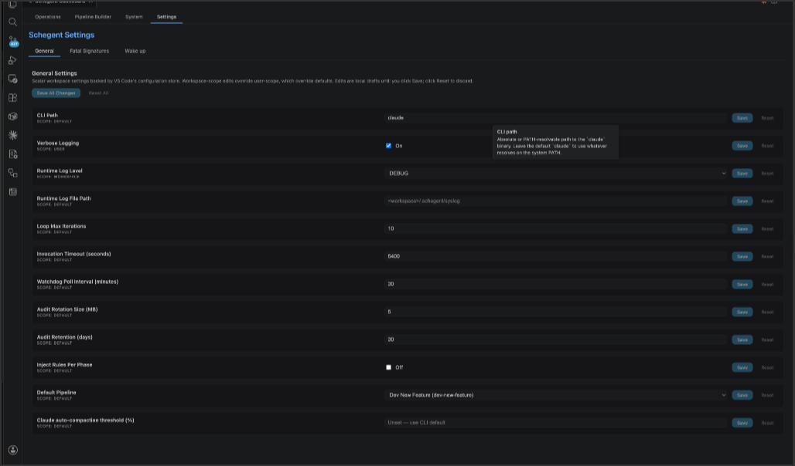
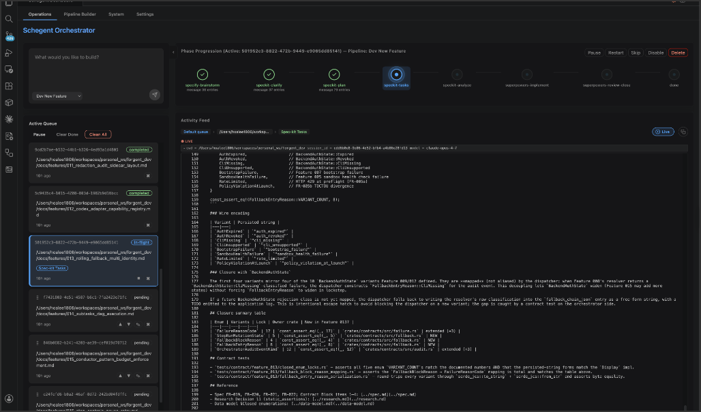

# Sidebar Tour

The Schegent sidebar is your primary control surface. Everything you do day-to-day — enqueueing work, monitoring runs, pausing, resuming, reviewing logs — happens here. This page walks every panel in order, top to bottom.

Open the sidebar by clicking the Schegent icon in the VS Code activity bar (the icon strip on the far left).

## The header

The header sits at the very top and tells you whether Schegent is ready to run.

- **CLI status badge** — green check (ready), yellow warning (authenticated but warning), or red cross (not detected or unauthenticated). Click it for diagnostic detail.
- **Primary host indicator** — if you have multiple VS Code windows open against the same workspace, this tells you whether the current window is the primary host (mutating commands enabled) or a secondary host (read-only).
- **Dashboard link** — opens the full-window dashboard in a new tab. Useful for long-running supervision.

If the CLI badge is red, no other panel will let you do mutating work. Fix the CLI wiring (see [Installation](installation.md)) before continuing.

## The queue panel

The next panel lists every task Schegent knows about, organized into four sections:

### In-flight

At most one task at a time. The in-flight task shows:

- The task description.
- The current phase id (e.g., `speckit-implement`).
- A live elapsed-time counter.
- A PID badge while the Claude subprocess is alive.
- Action buttons: **Pause**, **Cancel**, **Set Breakpoint**.

### Pending

Tasks waiting their turn, in order. The drainer will pick up the top entry as soon as the in-flight slot is free. You can:

- Drag-and-drop to reorder.
- Use the up/down arrows for finer control.
- Right-click → **Remove task** to delete.
- Right-click → **Edit** to change the description or phase overrides.

### Paused

Tasks the operator paused, or that hit a breakpoint. A paused task continues to *hold the workspace lock* (see [The Workspace Lock](../concepts/workspace-lock.md)), so the queue cannot drain past it. Click **Resume** to continue, or **Cancel** to release the lock and discard the run.

### Completed / Failed (history)

Terminal tasks. You can:

- Click a row to open a detail view with the run's full audit summary.
- **Rerun From History** to re-enqueue the same description with the same overrides.
- **Remove task** to clean up (with the optional session-tree cleanup dialog).
- Bulk actions: **Clear Completed**, **Clear Failed**.

## The phase log feed

Beneath the in-flight task, the phase log feed renders the live activity of the current phase as it streams in from the Claude CLI subprocess.

The feed is filtered to operator-relevant events:

- **Tool calls** — every `Read`, `Write`, `Edit`, `Bash`, `Grep`, etc. with sanitized arguments. Tool names render as badges; arguments are folded by default but expand on click.
- **Messages** — text Claude emits between tool calls.
- **Phase markers** — start and end boundaries with the phase id and outcome.
- **Errors and warnings** — anything Claude or the host classifies as concerning.

Above the feed are three controls:

- **Pause** — same as the queue panel's pause button.
- **Set Breakpoint** — opens a list of upcoming phases; pick one to pause the run before it starts.
- **Open in Dashboard** — opens the feed in the full-window console for a roomier view.

You can scroll back through past phases. The feed retains the full session as long as the run is in-flight; once the run terminates, you read it from `.schegent/audit.log` instead.

## The settings panel

A collapsible panel near the bottom for settings that benefit from being one click away. Each row maps to one or more entries in your VS Code `settings.json`.

The rows are grouped:

### CLI

- **CLI path** — bound to `schegent.cli.path`.
- **Backend** — bound to `schegent.backend.runner` (`claude` or `codex`).
- **Re-detect transport** — runs the `schegent.redetectClaudeTransport` command to re-probe how the CLI accepts prompts (argv vs file vs stdin).

### Models & phases

- **Phase model overrides** — opens a per-phase editor that writes to `schegent.phases`.
- **Available models** — bound to `schegent.models`. List of model identifiers your Pipeline Builder will surface.
- **Default pipeline** — bound to `schegent.defaultPipelineId`.

### Logging

- **Runtime log level** — bound to `schegent.logging.runtimeLogLevel`.
- **Runtime log path** — bound to `schegent.logging.runtimeLogFilePath`.
- **Verbose diagnostics** — bound to `schegent.logging.verbose`. Toggling this from the sidebar is the most common way to enable it for a specific debugging session.
- **Fatal signatures** — bound to `schegent.fatalSignatures`. Add operator-supplied substrings that should fail the active phase fast.

### Retries

- **Max retry attempts** — bound to `schegent.retry.maxAttempts`.
- **Auto-compact override** — bound to `schegent.claude.autoCompactPctOverride`.

### Wake-up

A dedicated sub-panel for the wake-up scheduler. See [Wake-up Scheduler](../features/wake-up-scheduler.md) for the full reference.

Every save in this panel is transactional and validates against the same schema VS Code's Settings UI uses. Invalid values surface inline rejection messages.

## The audit / log links

A small footer at the bottom of the sidebar links to:

- **Show Audit Log** (`schegent.showAuditLog`) — opens `.schegent/audit.log` in an editor tab so you can read the structured trail.
- **Show Active Run** (`schegent.showActiveRun`) — scrolls to and selects the in-flight task. Useful if you have a long history.
- **Reset Workspace State** (`schegent.reset`) — *destructive*. Clears the queue, runs, and pause state. Does not touch `.schegent/audit.log`. Use as a last resort after a hard crash.

## The dashboard (full window)

Click **Open Dashboard** in the header to launch the full-window console. The dashboard is the same data model, larger. It is the place to monitor a long-running pipeline, or to keep an eye on multiple workspaces if you have several VS Code windows open at once.

Highlights of the dashboard:

- A bigger phase log feed with multi-line tool-call rendering.
- The runtime debug log tail, side-by-side with the phase log.
- A queue overview with longer history and richer filtering.
- Quick access to the **Pause Queue** / **Resume Queue** controls.

The dashboard is a thin shell over the same projector that drives the sidebar — state stays in sync between them in real time.

## Keyboard and command-palette equivalents

Every visible action has a command palette equivalent. You can drive Schegent without the sidebar if you prefer. The most commonly used:

| Action | Command id | Palette title |
|---|---|---|
| Run autonomous workflow | `schegent.auto` | Schegent: Run Autonomous Workflow |
| Enqueue feature request | `schegent.schedule` | Schegent: Enqueue Feature Request |
| Resume a paused/failed run | `schegent.resume` | Schegent: Resume Paused or Failed Workflow |
| Cancel the in-flight run | `schegent.cancel` | Schegent: Cancel In-Flight Workflow |
| Pause the queue | `schegent.pauseQueue` | Schegent: Pause Queue |
| Resume the queue | `schegent.resumeQueue` | Schegent: Resume Queue |
| Show audit log | `schegent.showAuditLog` | Schegent: Show Audit Log |
| Open dashboard | `schegent.openDashboard` | Schegent: Open Dashboard |
| Reset workspace state | `schegent.reset` | Schegent: Reset Workspace State |

The full list lives in [Commands Reference](../reference/commands.md).

## A note on multi-window workflows

If you open the same workspace folder in a second VS Code window, the sidebar in that window is **read-only**. Every button still renders, but the host rejects mutating commands with `reason: 'not-primary-host'`. The read-only view is useful for monitoring a second workspace from a separate window while keeping the primary one as the operator console; it is not useful for parallel writes.

The next pages in this manual are:

- [The Concept docs](../concepts/architecture-overview.md) for the model behind the sidebar.
- The [Features pages](../README.md#features) for in-depth references on each capability.
- The [Reference pages](../README.md#reference) for lookup tables of every setting, command, audit event, and file path.
