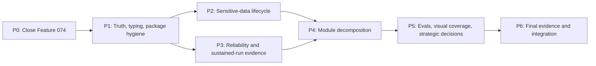

# Consolidated Architecture and Reliability Remediation Plan

Plan date: 2026-08-01

Sources consolidated:

- [Principal architecture review](principal-architecture-review-2026-05-18.md)
- Feature 074 implementation and both code/security review rounds
- Current source, CI, package, test, and documentation evidence

This plan is the execution backlog for every actionable finding. It separates
already-remediated findings from current work so historical review statements
do not override newer repository evidence.

## Outcome and exit criteria

Schegent remains a local-first, single-active-run VS Code extension. The work
is complete when:

1. No open Critical or High finding remains within the supported local,
   single-operator product boundary.
2. Every supported backend has bounded in-memory output, complete local raw
   capture, fail-closed result classification, and explicit capability checks.
3. Sensitive session artifacts have enforced lifecycle controls and cannot be
   packaged or accidentally exported as normal diagnostics.
4. All test sources are typechecked, the VSIX contains only an explicit set of
   runtime/release assets, and dependency policy blocks releases as documented.
5. Sustained-run tests cover memory, disk, log rotation, and partial-I/O
   failure behavior.
6. Core modules have named owners, narrower responsibilities, and ratcheted
   line budgets after each safe extraction.
7. `npm run ci`, both dependency audits, the package-content gate, code review,
   and security review are green on the final integrated commit.

## Current finding register

Status values are `Done`, `In progress`, `Planned`, `Decision`, or `Accepted`.

| ID | Finding | Severity | Current evidence and disposition | Status |
|---|---|---:|---|---|
| F-001 | Dynamic/custom phase audit records could be dropped during initial hydration. | High | Parser now preserves non-empty phase IDs and has regression coverage. | Done |
| F-002 | Host, schema, and UI default-pipeline values drifted. | Medium | Defaults and parity tests are aligned. | Done |
| F-003 | Security-reporting and repository metadata used stale placeholders. | Medium | `SECURITY.md`, GitHub templates, and ownership metadata were corrected. | Done |
| F-004 | Release workflow referenced a missing runbook. | Medium | Root `RELEASE.md` now defines the full gate, dependency policy, release, and rollback procedure. | Done |
| F-005 | Dependency audit was informational rather than blocking. | Medium | Weekly root and webview audits now fail at `low+`; PR dependency review blocks newly introduced `high+` findings. | Done |
| F-006 | Mutating IPC safety depended on an isolated hand-maintained router list. | High | Metadata is centralized in `sidebar-command-metadata.ts`, the router derives its set, and naming/pinned-list tests enforce coverage. Residual manual classification is an explicit review duty. | Accepted |
| F-007 | Backend subprocesses inherited the full VS Code environment with no safer mode. | High | A central `inherit`/`minimal`/names-only `allowlist` policy now covers probes, phases, and pre-compaction while preserving the legacy boolean opt-out and compatibility default. | Done |
| F-008 | Raw and verbose diagnostic artifacts are unredacted and had no automatic retention. | High | One retention owner now protects active runs, prunes complete inactive groups by age/bytes, emits metadata-only evidence, and exposes usage/failures in Settings. | Done |
| F-009 | Runner stdout/stderr capture could grow memory without a durable bound. | High | Feature 074 uses a 4 MiB ordered head/tail buffer with explicit truncation state and sustained-stream unit coverage. | Done |
| F-010 | A fatal error discarded from the middle of truncated output could be misclassified as clean. | Critical | Truncated otherwise-clean/malformed output now fails terminally with `output-truncated-unclassifiable`. | Done |
| F-011 | Bounded parser buffers could also truncate the canonical raw transcript. | High | Runner chunks are teed with backpressure to private `0600` spools and streamed into the append-only raw transcript. Late spool failures rewind partial copies, and pre-compaction uses a separate invocation transcript. | Done |
| F-012 | Separate Codex `agent_message` records could concatenate and corrupt headings/audit markers. | High | The stream un-wrapper recognizes current snake-case and legacy dotted completion events and inserts a logical newline boundary with regression coverage. | Done |
| F-013 | Codex `workspace-write` protects `.git`, so branch/commit phases could never complete. | High | Branch-creating and Git-mutating built-ins are pinned to Claude; config, IPC, run-start, runtime, and UI layers reject Codex/inherited selection. | Done |
| F-014 | Activity Feed selection used a feature-request ID where a run ID was required. | High | Projection now resolves the selected request to its current run identity and has regression coverage. | Done |
| F-015 | Run-start CLI probing could validate only the global runner instead of every effective pipeline runner. | High | Guarded start and run-driver probing now resolve all distinct effective runner kinds, with legacy snapshot/default pinning covered. | Done |
| F-016 | In-memory output and raw-capture docs described old silent truncation/streaming behavior. | Medium | Performance, monitoring, and raw-transcript docs now describe bounded head/tail parsing, fail-closed classification, and complete spool-backed capture. | Done |
| F-017 | Ten test paths were excluded from the primary TypeScript no-emit check, including a stale path. | Medium | `tsconfig.tests.json` now checks the full host test tree, stale per-test exclusions are gone, and local/PR/push/full-gate entry points enforce it before lint. | Done |
| F-018 | The packaged VSIX contained development-only files. | Medium | Packaging now uses an exact 20-entry allowlist, compressed/uncompressed size limits, a junk-file regression, and automatic temporary-artifact cleanup. | Done |
| F-019 | Core composition, orchestration, contracts, validation, and projection modules remain dense. | Medium | Focused owners now hold phase control, lifecycle audit, activation wiring, projector timing/tail state, validator domains, and IPC type families. The original files fell to 1301, 727, 745, 883, and 871 lines respectively, with lower enforced budgets. | Done |
| F-020 | There is no sustained multi-hour-equivalent memory/filesystem pressure profile. | Medium | A deterministic real-child profile exceeds both parser caps, proves exact raw capture, exercises terminal modes/restart/retention/large phase hydration, and publishes a larger scheduled soak report. | Done |
| F-021 | Disk-full and partial-write behavior is observable but not expressed as a single evidence-health state. | Medium | A workspace-scoped monitor now projects per-sink and overall health, coalesces warnings, fails execution closed when structured audit is unavailable, and keeps optional raw/runtime failures visibly degraded. | Done |
| F-022 | LLM behavior has deterministic workflow tests but no first-class quality/evaluation corpus. | Medium | A versioned nine-scenario backend-neutral corpus now scores structural outcomes, failure precedence, truncation safety, and session ownership; PR/local gates run all 10 assertions and supported CLI bands are published. | Done |
| F-023 | Browser-level visual regression is not a universal UI gate. | Low | Playwright now compares 15 production-webview baselines: Sidebar, Dashboard, Pipeline Builder, Metrics, and Activity Feed across light, dark, and high-contrast themes, with volatile values masked and a canonical Linux CI renderer. | Done |
| F-024 | Documentation had multiple truth surfaces and the dated audit contained resolved claims. | Medium | A dated addendum preserves the historical review while explicitly superseding resolved claims and linking this canonical open-work register; release and build docs reflect the enforced gates. | Done |
| F-025 | Remote, multi-user, or parallel-agent operation would exceed current lock/scheduler/trust assumptions. | Critical for expansion | The [accepted expansion gate](../architecture/remote-multi-user-expansion-gate.md) blocks cap/network widening until identity, isolation, durable scheduling, fencing/idempotency, secrets, evidence, injection, threat-model, and rollback criteria are approved and proven. | Accepted |
| F-026 | True offline execution depends on an offline-capable backend and explicit degraded-mode UX. | Medium | [Local-first versus offline](../concepts/local-first-not-offline.md) is now explicit, queue-only behavior and a future discovery contract are specified, and the Dashboard discloses provider network dependence before submission. Offline AI execution is not a current product promise. | Accepted |
| F-027 | VS Code integration workers could report assertion failures while the launcher exited zero; the metrics refresh budget was unstable under parallel-host contention. | High | The launcher now uses one isolated profile/extension directory, requires exactly one schema-validated host result with zero failures, and rejects missing, duplicate, or failing markers. A real-host run completed all 11 modules within both metrics budgets. | Done |

## Delivery sequence

P0 was release-blocking for Feature 074. P1-P5 are complete. P6 is the final
proof gate.

## P0 — Close Feature 074 safely

Priority: immediate. Findings: F-009 through F-016.

### Tasks

- Keep parser memory bounded with ordered head/tail retention and a sticky
  truncation flag for stdout and stderr.
- Keep the canonical raw transcript complete via private disk spools; exercise
  write-stream backpressure and delete spools in every terminal path.
- Treat inconclusive truncated output as terminal failure; never advance a
  phase merely because a clean token survived in the retained tail.
- Preserve boundaries between distinct Codex completed messages.
- Pin `speckit-specify`, `specify-brainstorm`, `superpowers-implement`,
  `finalize`, and `superpowers-review-close` to Git-capable runners. Enforce
  the policy in catalog validation, save IPC, guarded start, runtime dispatch,
  and Pipeline Builder affordances.
- Preserve the selected feature-request-to-run identity mapping in Activity
  Feed and probe every effective backend in a pipeline.
- Correct `docs/operations/performance.md` and any other stale stream-capture
  wording.
- Run a final uncommitted code/security review, `npm run ci`, and diff checks.

### Acceptance evidence

- A fatal message placed only in the discarded middle cannot produce an
  advancing outcome.
- A long stream keeps bounded heap while its raw transcript hashes to the
  original bytes.
- A legacy Codex snapshot targeting `finalize` fails before `phase-start` or
  subprocess invocation.
- Two adjacent Codex model records remain two lines for downstream parsers.
- All host/webview tests, build, VSIX smoke, E2E, and VS Code integration pass.

### Completion evidence (2026-08-01)

- Focused audit-boundary regression set: 80/80 tests passed, including source
  line-budget enforcement.
- Full host suite: 3,305 passed, 10 skipped; webview suite: 878 passed; E2E:
  3 passed. Host/webview typechecks, zero-warning lint, build, and VSIX smoke
  passed through `npm run ci`.
- The completed independent review's two final P2 findings (late spool failure
  and shared compaction transcript) were fixed with direct regression tests.
  A follow-up review attempt was unavailable because the review workspace ran
  out of credits.
- The integration false-green discovered during the original run was tracked
  as F-027 and closed in P1 with an isolated profile plus an authoritative
  single-host result protocol.

## P1 — Restore one operational truth and tighten build artifacts

Priority: quick win. Findings: F-017, F-018, F-024, F-027.

### P1.1 Audit status addendum

- Add a dated addendum to the May review rather than rewriting historical
  observations.
- Mark F-004/F-005/F-006 and the environment opt-out portion of F-007 as
  remediated with current file evidence.
- Link this plan as the canonical open-work register.

Acceptance: no current document says `RELEASE.md` is missing or dependency
audit is non-blocking without a historical-status qualifier.

### P1.2 Dedicated typed-test configuration

- Create `tsconfig.tests.json` extending the host config and typecheck every
  extant test source.
- Remove the stale exclusion for the nonexistent audit-taxonomy test.
- Fix the excluded tests rather than weakening compiler options.
- Add `typecheck:tests` before lint in `ci`, `ci:fast`, PR, push, and full-gate
  workflows.

Acceptance: no existing `tests/**/*.ts` file is omitted from static checking;
the exclusion list contains only generated/runtime artifacts.

### P1.3 Exact VSIX content policy

- Replace the smoke script's prefix-only checks with an explicit allowlist of
  package metadata, runtime bundles, required images/icons, README, LICENSE,
  SECURITY, and RELEASE.
- Exclude `.github/**`, `test_output.txt`, Cargo manifests, Rust contract
  sources, and any other development-only file from `.vscodeignore`/packaging.
- Package into a temporary path and clean it after inspection so local smoke
  runs do not leave stale VSIX files.
- Add maximum compressed/uncompressed size budgets and fail on unexpected
  entries.

Acceptance: a deliberate junk-file fixture fails the package gate, while a
fresh VSIX installs and activates in the integration smoke.

### P1.4 Make integration failures authoritative

- Propagate every worker assertion or extension-host failure to the launcher
  exit code; add a regression that proves a failing worker makes
  `test:integration` non-zero.
- Run the metrics refresh performance assertion in a resource-isolated profile
  or replace shared-host wall-clock timing with a deterministic cost measure.
- Keep one bounded real-host timing smoke, but do not fan it out across
  contending extension hosts.

Acceptance: an injected integration failure makes `npm run ci` non-zero, and
the metrics budget passes repeatedly without hiding regressions or relying on
parallel-host scheduling luck.

### Completion evidence (2026-08-01)

- `npm run typecheck:tests` checks every `tests/**/*.ts` source; build-policy
  tests enforce the local scripts and all three CI workflow entry points.
- A fresh package passed the exact 20-entry policy at 682,760 compressed bytes
  and 1,655,993 uncompressed bytes. Unexpected, missing, duplicate, and unsafe
  entries are rejected, and smoke packaging leaves no repository artifact.
- The historical review now starts with a dated status addendum and points to
  this plan for current open work.
- Unit tests reject missing, duplicate, malformed, and failing integration-host
  results. The real-host smoke used unique user-data/extensions directories,
  reported exactly one host with 11 executed modules, and passed both metrics
  budgets (33.4 ms initial open; 19.5 ms refresh).
- Compatibility-safe lockfile updates cleared all root and webview dependency
  advisories; both `npm audit --audit-level=low` commands report zero findings.
- After the dependency updates, `npm run ci` passed again: 3,315 host tests
  passed (10 skipped), 878 webview tests passed, 3 E2E tests passed, and the
  isolated real host completed all 11 integration modules.

## P2 — Sensitive-data lifecycle and subprocess environment

Priority: High privacy/security. Findings: F-007, F-008, F-021.

### P2.1 Session artifact retention

- Add a single policy owner for raw transcripts and verbose diagnostic trees.
- Introduce age and total-byte budgets with conservative defaults. Prune only
  complete, inactive run artifacts; never modify `.schegent/audit.log`.
- Sweep on activation and after a run reaches a terminal state. Task deletion
  remains an immediate best-effort cleanup path.
- Emit one sanitized, metadata-only retention event per sweep: counts/bytes,
  no paths, prompts, or raw filenames.
- Surface current usage and the local-only warning in Settings/operations docs.

Acceptance: deterministic clock/filesystem tests prove age, byte, active-run,
failure, and idempotency behavior; secrets and paths never enter audit/UI.

### P2.2 Environment minimization

- Preserve the existing `inheritEnvironment=false` escape hatch across every
  backend and compaction invocation.
- Add a named allowlist mode that forwards only required process bootstrap
  variables plus operator-approved names. Reject secret values in settings;
  configuration stores names only.
- Warn once per workspace when unrestricted inheritance is active and link to
  migration guidance.
- Collect compatibility evidence before changing the default. A default flip
  requires a major-version migration note and backend-specific auth tests.

Acceptance: injected secret fixtures are absent in scrubbed/allowlist modes;
PATH, locale, home/keychain behavior is tested on macOS, Linux, and Windows.

### P2.3 Evidence-health state

- Model audit/raw/runtime sink health separately from phase outcome.
- Coalesce repeated I/O warnings and expose a sanitized dashboard/status-bar
  degradation indicator.
- Define which failures are availability-preserving warnings and which must
  fail closed because required evidence cannot be recorded.
- Add fault-injection tests for permission denial, ENOSPC, partial writes,
  stream errors, and cleanup failures.

Acceptance: an operator can determine from one status/audit projection whether
execution evidence is complete, degraded, or unavailable.

### Completion evidence (2026-08-01)

- Session retention enforces age/byte limits only beneath
  `.schegent/sessions`, protects active runs, sweeps at activation/terminal
  transitions/configuration changes, and exposes paths-free usage metadata.
- Backend probes, phase invocations, and Claude pre-compaction share the
  `inherit`/`minimal`/names-only `allowlist` environment resolver. Settings
  reject value-bearing entries and keep the compatibility default explicit.
- Audit, raw-transcript, and runtime-log sinks report through one health
  projection. Structured audit is required and fails the active run closed;
  raw/runtime failures continue degraded. Status-bar and dashboard indicators,
  warning coalescing, normalized causes, and recovery guidance are covered.
- Deterministic fault tests cover permission denial, ENOSPC, partial writes,
  stream and cleanup causes, protected retention, and metadata-only output.

## P3 — Sustained-run performance and recovery evidence

Priority: Medium reliability/performance. Findings: F-020, F-021.

### Tasks

- Add a deterministic high-volume runner fixture that emits interleaved
  stdout/stderr beyond the memory cap, includes multibyte UTF-8 boundaries,
  and ends cleanly, fatally, by timeout, and by cancellation.
- Assert peak retained bytes independently from total emitted bytes; avoid a
  wall-clock/RSS assertion that would be flaky in shared CI.
- Hash the raw transcript payload to prove completeness and ordering.
- Exercise repeated audit rotation, retention pruning, phase-log hydration,
  and dashboard projection over large archives.
- Add failure injection for read-only workspace, ENOSPC, interrupted spool
  append, extension-host restart, and stale spool cleanup.
- Keep a smaller blocking CI profile and a larger scheduled/manual soak
  profile with retained failure artifacts.

Acceptance: blocking tests complete within defined time/space budgets and the
scheduled soak reports bounded memory, bounded retained disk, no orphaned
spools, and deterministic recovery.

### Completion evidence (2026-08-01)

- The blocking real-child profile emits 4,600 records per stream (9,600,264
  output bytes total), while retained parser state stays at two independent
  4 MiB caps and the raw transcript hashes to the original streams.
- Split UTF-8 writes and clean, fatal, timeout, and cancellation terminal modes
  pass through the production runner path.
- A 10,000-row phase log projects the newest 200 ordered entries. The exercise
  exposed and fixed an off-by-one dropped-entry count when the marker consumes
  a retained slot.
- Forty forced audit rotations in one second retain all forty archives using a
  collision-resistant timestamp/random suffix; legacy archive names still
  participate in retention.
- Simulated extension-host restart scavenges an abandoned dead-owner spool,
  leaves zero spools, and inactive-session pruning restores the byte budget.
- The weekly/manual full gate runs 20,000 records per stream and uploads a
  metadata-only JSON soak report for 30 days.

## P4 — Incremental module decomposition

Priority: Medium maintainability. Finding: F-019.

Every extraction must be behavior-preserving, land separately, and ratchet the
source line budget downward. Do not combine decomposition with feature changes.

| Order | Current owner | Extracted responsibility | Target module/service | Proof |
|---:|---|---|---|---|
| 1 | `workflow-controller.ts` | pause/resume/restart/skip/enable/disable/remove mutation policy | `phase-control-service.ts` | Existing phase-control, breakpoint, continuation, and audit parity tests |
| 2 | `workflow-controller.ts` | task/phase lifecycle audit construction | `workflow-lifecycle-auditor.ts` | Exact event taxonomy and payload tests |
| 3 | `extension.ts` | backend/configuration composition | `activation/backend-wiring.ts` | Activation and configuration-access tests |
| 4 | `extension.ts` | sidebar/dashboard command registration and disposal | `activation/ui-wiring.ts` | Extension activation + command registration tests |
| 5 | `state-projector.ts` | audit-tail hydration/cache and activity timing | `audit-tail-state.ts`, `activity-timing.ts` | Cold-start, freshness, unchanged-snapshot, and perf tests |
| 6 | `runtime-validators.ts` | command-domain validators | domain validator modules with one public registry | Contract drift and malformed-input tests |
| 7 | `sidebar-ipc.ts` | command/query/response type families | focused contract modules with stable barrel exports | Generated schema and Rust parity checks |

After each extraction:

- keep dependency direction host/UI → contracts/services → domain utilities;
- add a module-ownership table to `ARCHITECTURE.md`;
- lower, never raise, the affected line budget;
- run focused tests, `npm run typecheck`, `npm run lint`, then `npm run ci`.

### Completion evidence (2026-08-01)

- All seven planned responsibility slices were completed across separately
  gated commits, adding named owners for phase-control policy, workflow
  lifecycle audit construction, backend/config composition,
  UI wiring, activity timing, audit-tail state, validator domains, and IPC wire
  type families. `ARCHITECTURE.md` records each ownership boundary.
- The dense entry points moved from the plan baseline to: `extension.ts`
  1462 → 1301 lines, `workflow-controller.ts` 1198 → 727,
  `runtime-validators.ts` 1127 → 745, `sidebar-ipc.ts` 1214 → 883, and
  `state-projector.ts` 902 → 871. Enforced budgets are now 1305, 730, 775,
  885, and 875 respectively.
- The runtime validator remains the single exhaustive command registry while
  phase-log, wake-up, queue, and metrics rules have focused modules. The
  sidebar IPC surface remains backward compatible while five domain type
  families live behind its stable exports.
- Contract reconciliation exposed and fixed a pre-existing metrics guard typo
  (`includeArchived` versus `includeArchives`) with a regression assertion.
  Generated schemas remained fresh. A disk-heavy evidence test also received
  an explicit 15-second integration timeout after reproducing a 5.005-second
  default-timeout false failure under full-suite contention.
- The final P4 gate passed 3351 host tests (10 skipped), 883 webview tests,
  14 performance tests, 3 E2E tests, the exact 20-file VSIX policy, and all
  11 isolated real-host integration modules.

## P5 — Evaluation, visual confidence, and product-boundary decisions

Priority: Medium/Low investment. Findings: F-022, F-023, F-025, F-026.

### P5.1 LLM/backend evaluation corpus

- Define backend-neutral fixtures for clean completion, clarification loops,
  remaining issues, malformed audit blocks, fatal errors, rate limits,
  truncation, session continuation, and runner switches.
- Score structural outcomes and safety invariants, not subjective prose.
- Run deterministic fake-CLI evals on PRs; run real CLI/version compatibility
  only in opt-in scheduled jobs with isolated credentials and no workspace
  secrets.
- Publish supported CLI version ranges and last-qualified dates.

### P5.2 Browser visual smoke

- Add targeted browser screenshots for Sidebar, Dashboard, Pipeline Builder,
  Metrics, and Activity Feed in light, dark, and high-contrast themes.
- Mask timestamps/run IDs, use deterministic data, and combine visual diffs
  with existing accessibility assertions.
- Keep this targeted; component behavior remains the primary fast gate.

### P5.3 Offline/degraded mode decision

- Prototype capability discovery for an offline backend without changing the
  runner contract.
- Specify queue-only/no-execution UX and make hidden network dependence visible
  before a run starts.
- Decide whether offline execution is a supported product promise. If not,
  document local-first versus offline clearly and close F-026 as accepted.

### P5.4 Expansion architecture gate

Do not implement remote, multi-user, or parallel-agent execution as an
incremental increase to the current concurrency cap. The accepted
[expansion gate](../architecture/remote-multi-user-expansion-gate.md) requires
a separate implementation RFC covering authentication/authorization, tenant
isolation, durable scheduling, distributed locking/idempotency, secret
brokering, evidence retention, prompt injection policy, threat modeling, and
rollback. Until its exit criteria are evidenced, F-025 remains an explicit
expansion blocker rather than a local-release defect.

### P5 completion evidence (2026-08-01)

- `test:evals` runs a versioned nine-scenario fixture corpus with 10 assertions
  across clean completion, loop outcomes, malformed audit data, fatal/rate
  limits, truncation, session continuation, and runner switching. It uses the
  production parsers and outcome/session policies, and is mandatory in local,
  PR, push, and scheduled gates.
- Backend documentation publishes last-qualified version bands for Claude Code
  2.1.220, Codex CLI 0.142.5, and Agy CLI 1.1.9 while keeping authenticated
  provider checks opt-in and isolated.
- `test:visual` serves production-built webviews through a loopback-only
  fixture host and compares 15 screenshots (five surfaces by three themes).
  Timestamps and process identity are masked, animations are disabled, data is
  deterministic, and Linux Chromium is the canonical workflow renderer with
  failure artifacts retained.
- The Dashboard now labels the product "Local-first, not offline" before
  submission. The accepted product decision specifies explicit queue-only
  operation, probe limitations, fail-closed capability discovery, and revisit
  criteria without pretending current cloud backends are offline-capable.
- The accepted expansion gate keeps concurrency at one and requires approved
  identity, tenant-isolation, durable-scheduler, fencing/idempotency, secret,
  evidence, prompt/tool, threat-model, and rollback evidence before remote,
  multi-user, or parallel-agent work may begin.
- The F-023 work package passed the full repository gate: 3,357 host tests (10
  skipped), 883 webview tests, 10 eval assertions, 15 browser screenshots, 14
  performance tests, 3 E2E tests, the exact 20-file VSIX policy, and all 11
  isolated real-host integration modules.

## P6 — Final verification and integration

For each independently reviewable work package:

1. Run focused unit/contract/integration tests.
2. Run `npm run typecheck`, `npm run typecheck:webview`, and the new
   `npm run typecheck:tests`.
3. Run `npm run lint`, `npm run test`, `npm run test:e2e`,
   `npm run test:perf`, `npm run build`, package smoke, and
   `npm run test:integration` through `npm run ci`.
4. Run root and `webview-ui` `npm audit --audit-level=low`; either reach zero
   findings or add a time-bounded owner/rationale to `RELEASE.md`.
5. Inspect the VSIX entry allowlist and size report.
6. Perform evidence-based code and security review; resolve every Critical,
   High, and Medium correctness finding before integration.
7. Commit with one conventional commit per work package and merge locally only
   after the corresponding gate is green.

## Priorities and dependencies

| Priority | Work | Dependency | Expected horizon |
|---:|---|---|---|
| 0 | Feature 074 correctness/security closure | None | Immediate |
| 1 | Audit truth, typed tests, exact package policy | P0 | Days |
| 2 | Retention, environment minimization, evidence health | P1 contract/settings baseline | Days to weeks |
| 3 | Sustained-run and failure-injection profiles | P0 capture behavior; P2 retention policy | Weeks |
| 4 | Core module decomposition | Stable P2/P3 behavior and regression suite | Weeks |
| 5 | Eval corpus and targeted visual smoke | Stable contracts after P4 | Weeks |
| 6 | Offline and expansion decisions | Product/security approval | Strategic |

## Release and expansion blockers

- Feature 074 must not ship until P0 is green and its Git-capability policy is
  enforced at runtime, not only in UI/configuration.
- No release may proceed with an undocumented dependency advisory at or above
  the configured policy floor.
- No release artifact may contain raw session data, workspace state, test
  output, source trees, repository automation, or local VSIX files.
- No remote/multi-user/parallel expansion may proceed without the P5.4 RFC.

## Explicit non-goals

- Centralized fleet telemetry is not added merely to imitate server products;
  local evidence remains the product's default.
- The append-only audit log is never pruned by session-retention work.
- The single-active-run invariant is not relaxed during this remediation.
- MCP, containers, or a remote service are not introduced without a concrete
  integration requirement and a new threat model.
