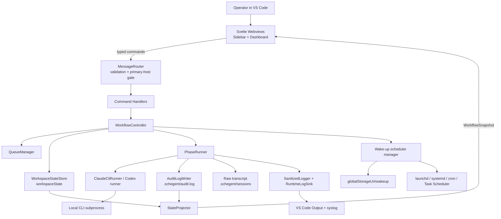

# Principal Architecture, Code, Security, Reliability, and Strategy Review

Review date: 2026-05-18

Scope: first-party implementation under `repo/`, planning-envelope docs under the workspace root where they govern agent behavior, package manifests, lockfiles, CI workflows, tests, security docs, webview code, host code, and active Speckit plan `specs/056-principal-arch-hardening/plan.md`. Generated `dist/`, `out/`, `.vscode-test/`, and dependency trees were excluded from code-quality judgment except where build and test behavior matters.

## Executive Summary

Schegent is fundamentally coherent and unusually well-instrumented for a local AI-agent orchestration extension. Its strongest properties are explicit security hard rules, centralized sanitization, typed IPC contracts, append-only audit discipline, single-queue concurrency invariants, and a broad regression suite that exercises host, webview, lint, parity, perf, E2E, and VS Code integration surfaces.

The main maturity risk is architectural density: the core controller, runner, state, and contract modules remain large enough that future feature work can accidentally cross trust boundaries even though many guardrails exist. This review found and fixed concrete drift in audit hydration, default settings parity, security/docs wording, GitHub metadata, and webview docs; remaining recommendations are mostly medium-term decomposition and operational hardening rather than release-blocking defects.

## Observed Facts, Inferences, and Unknowns

| Category | Evidence |
|---|---|
| Observed Facts | The host extension is TypeScript with strict compiler options (`tsconfig.json:2-20`), a Svelte 5/Vite webview (`webview-ui/README.md:1-12`), and build scripts in `package.json`. IPC mutation gating is centralized in `MUTATING_COMMANDS` (`src/ui/sidebar/message-router.ts:50-96`). Audit writes sanitize records before append (`src/audit/audit-log-writer.ts:113-125`). CSP denies default sources and remote script execution (`src/ui/sidebar/csp.ts:13-25`). |
| Reasoned Inferences | The architecture optimizes for local operator control and forensics over distributed scalability. The single-queue cap (`src/config/general-settings.ts:188-198`, `src/queue/queue-manager.ts:118-120`) is a deliberate reliability boundary, not a missing feature. |
| Unknowns / Missing Evidence | No release document exists at `repo/RELEASE.md`, although `.github/workflows/full-gate.yml:9-10` references it. External-market comparisons were conceptual; no external browsing was used. Product policy for long-term telemetry, dependency vulnerability SLAs, and multi-user workstation assumptions is only partially evidenced. |

## Remediation Applied During Review

| Finding | Severity | Fix |
|---|---:|---|
| Audit hydration rejected non-original phase ids, which could drop valid `bugfix-*` or custom-phase audit events from initial dashboard tail hydration. | High | `parseAuditLogLineDetailed()` now preserves any non-empty phase id (`src/parser/audit-log-parser.ts:37-44`) and has regression coverage (`tests/unit/parser/audit-log-parser-monitor.test.ts`). |
| Host idle settings defaulted `defaultPipelineId` to `standard` while package/default schema used `speckit-new-feature`. | Medium | `IDLE_GENERAL_SETTINGS` now matches the package and host schema (`src/ui/sidebar/snapshot.ts:428-456`), with parity coverage (`tests/parity/settings-defaults-parity.test.ts:134-149`). |
| Documentation and GitHub metadata had stale or placeholder security links/owners. | Medium | Fixed private advisory links, CODEOWNERS placeholders, PR/security template paths, security wording, and default-pipeline docs. |
| Webview README still described two Settings tabs and an outdated dashboard entry path. | Low | Updated route and Settings-tab descriptions in `webview-ui/README.md`. |
| Root planning-envelope threat model had stale feature/status and runtime storage wording. | Low | Updated root `docs/security/threat-model.md` to reflect `.schegent/` artifacts and VS Code storage. |

## Phase 1: Comprehension and Architecture Analysis

### Documentation Assessment

| Document | Purpose | Strengths | Gaps | Staleness Risk | Missing Critical Information |
|---|---|---|---|---|---|
| Root `README.md` | Planning-envelope overview | Explains Schegent and Speckit workflow. | Less detailed than implementation docs. | Medium | Clear pointer that implementation commands run from `repo/`. |
| Root `AGENTS.md` / prompt rules | Agent operating contract | Strong hard-rule summary and active plan pointer. | Duplicates implementation security rules. | Medium | Automated drift guard exists for CLAUDE anchors, not all prose. |
| Root `ARCHITECTURE.md` | Architectural map | Detailed, current enough to orient agents. | Separate from `repo/ARCHITECTURE.md`, creating two truth surfaces. | Medium | Ownership rule for which architecture doc wins on conflict. |
| Root `docs/security/threat-model.md` | Agent-facing trust model | Covers broad local threats and wake-up scheduler. | Previously had stale `.specify/` runtime wording; fixed. | Medium | Needs an explicit relationship to `repo/docs/security/threat-model.md`. |
| `repo/README.md` | User/operator overview | Good feature matrix, settings, log layout, verification commands. | Dense; onboarding path can be long for new contributors. | Low | A short "first safe local run" path would help. |
| `repo/ARCHITECTURE.md` | Implementation architecture | Maps host, webview, audit, wake-up, state, and security invariants. | Large and partly mirrors security docs. | Low | A module ownership table would help decompose large files. |
| `repo/docs/security/threat-model.md` | Operator threat catalog | T1-T20 catalog with mitigations and lint parity (`docs/security/threat-model.md:5-30`). | Local diagnostic sink wording was internally inconsistent; fixed. | Low | More explicit vulnerability severity rubric. |
| `repo/SECURITY.md` | Reporting and public posture | Private advisory workflow now points to real repository (`SECURITY.md:37-45`). | No stated dependency-vulnerability response SLA. | Medium | Supported-version matrix beyond current version. |
| `repo/docs/operations/*` | Operator runbooks | Strong operational docs for audit/runtime logs and troubleshooting. | One default-pipeline stale reference was fixed. | Low-Medium | Release runbook is referenced by CI but missing as `RELEASE.md`. |
| `repo/webview-ui/README.md` | Webview architecture and IPC rules | Documents sidebar/dashboard split and helper-only IPC conventions. | Route/tab text was stale; fixed. | Low | UI accessibility acceptance criteria are mostly test-driven, not operationally summarized. |
| `.github/workflows/*.yml` | CI/security automation | Full gate, PR gate, security audit, artifact upload on failure (`.github/workflows/full-gate.yml:26-165`). | Security audit is non-blocking by design (`.github/workflows/security-audit.yml:42-49`). | Medium | Policy stating when audit findings must block release. |

### Core Objective

Schegent is a local VS Code extension that drives the Claude CLI as a headless backend through a Speckit-style multi-phase development workflow. Its target audience is trusted local operators and maintainers who want autonomous spec-to-implementation execution with auditability, resumability, and a constrained VS Code webview control surface.

### System Context

Major subsystems:

- Extension host activation, command registration, workspace trust, and panel lifecycle.
- Workflow orchestration: queue manager, workflow controller, phase runner, retry/backoff, pause/resume, breakpoints.
- Backend runner integration with Claude/Codex CLI subprocesses.
- Audit, raw transcript, runtime log, phase log feed, verbose diagnostics.
- Workspace and global-storage persistence.
- Svelte webview: compact sidebar plus dashboard/settings/pipeline builder.
- Wake-up scheduler runner and OS-native scheduling adapters.

Trust boundaries:

- Operator and trusted workspace vs untrusted webview IPC (`message-router.ts:50-109`).
- Extension host vs external CLI binary (`src/runner/claude-cli.ts:195-282`).
- Sanitized audit/runtime/UI sinks vs local-only raw/verbose diagnostics (`docs/security/threat-model.md:62-112`).
- Primary VS Code window vs secondary windows for mutating commands.
- Workspace state vs global storage for wake-up records and session log.

### Technical Approach

| Area | Approach |
|---|---|
| Languages/frameworks | TypeScript host, Svelte 5 webview, Vite/esbuild builds, Vitest, `@vscode/test-electron`. |
| Architecture pattern | Local-first extension host with typed IPC, append-only event evidence, stateful workflow controller, pure projection modules where possible. |
| Communication | Webview posts typed commands; host validates and acknowledges; host publishes `WorkflowSnapshot`. CLI subprocess streams are monitored through hooks. |
| Persistence | VS Code `workspaceState` for queue/run state, workspace `.schegent/` for audit/runtime/session artifacts, global storage for wake-up scheduler/session records. |
| Security strategy | Central redaction set (`src/lib/logger.ts:1-35`), strict CSP, primary-host mutation gate, workspace-trust restrictions, append-only audit, lint parity tests. |

### Architecture Decisions and Trade-offs

| Decision | Benefit | Cost / Constraint |
|---|---|---|
| Local VS Code extension instead of service backend | Strong privacy/locality, no server ops, operator owns workspace. | Workstation environment and CLI binary become the trust boundary; no centralized fleet observability. |
| Single queue and concurrency cap of 1 | Predictable state transitions, fewer races, easier audit/recovery. | Throughput and multi-agent parallelism are intentionally limited. |
| Central `SanitizedLogger` redaction | One redaction set feeds audit/runtime/IPC projections (`src/lib/logger.ts:115-138`). | Pattern-based redaction can miss novel secrets; raw transcripts remain local-only risk. |
| Append-only structured audit | Forensic continuity, safer deletion semantics, recoverable dashboard hydration. | Requires careful rotation/retention and parser backward compatibility. |
| Typed but in-process IPC instead of network API | Smaller attack surface and no CSRF/SSRF class from HTTP. | Webview contracts are coupled to host type exports and runtime validators. |
| Prompt-file/stdin probing with legacy `-p` fallback | Reduces argv prompt exposure when CLI supports safer transport (`src/runner/claude-cli.ts:219-253`). | Fallback remains a privacy risk on older CLI versions. |

### Component Diagram



### Primary Data / Control Flow

```mermaid
sequenceDiagram
  participant U as Operator
  participant W as Webview
  participant R as MessageRouter
  participant Q as QueueManager
  participant C as WorkflowController
  participant P as PhaseRunner
  participant B as BackendRunner
  participant A as Audit/Logs
  participant S as WorkspaceState

  U->>W: Start / enqueue feature
  W->>R: SidebarCommand with payload
  R->>R: Runtime validation + trust/primary-host gate
  R->>Q: Enqueue validated request
  Q->>S: Persist pending queue item
  C->>S: Acquire lock and mark run in-flight
  loop Each phase
    C->>P: PhaseRunInput
    P->>A: phase-start audit + raw transcript open
    P->>B: Spawn CLI with timeout/transport/model/effort
    B-->>P: stdout/stderr/exit/truncation flags
    P->>A: Sanitize audit/runtime surfaces; local raw/verbose as configured
    P-->>C: Outcome success/failure/retry/pause
    C->>S: Persist run, retry, pause, or advancement state
  end
  C->>A: terminal audit event
  S-->>W: Projected WorkflowSnapshot via StateProjector
```

### Data Flow and State Mapping

| Stage | Validation / Transformation | Persistence / Side Effects | Error / Recovery Path |
|---|---|---|---|
| Webview command ingress | Runtime validators reject malformed commands; mutating commands must pass primary-host gate. | Acks return to webview; mutations route to command handlers. | Invalid commands are rejected and audited/logged through sanitized paths. |
| Queue enqueue | Description trimmed/validated; queue id normalized to single default queue. | `workspaceState` queue record. | Store write errors surface through command rejection; capacity cap prevents >1 in-flight. |
| Run start | Workflow lock and persisted run invariants protect concurrency. | `WorkflowRun` persisted with pipeline snapshot. | Crashes hydrate state; stale lock recovery exists; invariants reject malformed state. |
| Phase invocation | Prompt composition, model/effort/settings resolution, runner input shape. | Audit start, raw transcript, optional verbose diagnostics, runtime log. | Timeout/cancel/backoff/fatal signature classification; delayed retry cap; pause/resume continuation flag. |
| Audit tail hydration | JSONL parse, unknown event types preserved, dynamic phase ids preserved after fix. | Dashboard initial audit tail projection. | Malformed lines dropped with one debug warning (`state-projector.ts:379-405`). |
| Wake-up scheduler | Settings validation, model registry, env scrub, cwd defense. | OS scheduler entry, global-storage invocation/session logs. | Per-host lock skip, capped session log, unavailable reason displayed. |

## Phase 2: Implementation Verification

### Structural Scan

The repository is organized around recognizably separate layers: `src/controller`, `src/queue`, `src/state`, `src/runner`, `src/audit`, `src/config`, `src/ui`, `src/wakeup`, and `webview-ui/src`. That separation is real, and lint tests pin several boundary rules such as no `vscode` imports in headless/wakeup/telemetry code.

The main structural weakness is file size and orchestration density. Current large modules include `src/controller/workflow-controller.ts` at 1415 lines, `src/extension.ts` at 1265, `src/controller/phase-runner.ts` at 1137, `src/contracts/runtime-validators.ts` at 964, and `src/contracts/sidebar-ipc.ts` at 889. These are not automatically wrong, but they are where future hidden coupling is most likely to enter.

### Runtime and Build Surface

| Surface | Assessment |
|---|---|
| Build reproducibility | Good. `.nvmrc`, npm lockfiles, `npm ci --ignore-scripts` in CI, esbuild/Vite scripts. |
| Testability | Strong. `npm run ci` covers host/webview typecheck, lint, tests, deterministic E2E, build, and VS Code integration. |
| CI/CD | Good breadth, but full gate is scheduled/manual rather than every PR; PR gate is lighter by design. |
| Deployment | VS Code extension packaging model inferred; no container/deployment manifests because this is local software. |
| Dependency hygiene | Security audit workflow exists, but `continue-on-error: true` prevents dependency findings from failing the job. |

### Architecture Drift Register

| Type | Intended Design | Observed Reality | Evidence | Impact | Severity | Recommended Fix |
|---|---|---|---|---|---:|---|
| Design Drift | Dynamic/custom phases should survive audit parsing. | Parser previously pinned phase ids to an old fixed set. | Fixed current parser accepts non-empty strings (`src/parser/audit-log-parser.ts:37-44`). | Dashboard audit tail could lose valid records. | High | Fixed and covered by parser regression. |
| Doc Drift | Default pipeline is `speckit-new-feature`. | Operations docs and idle host snapshot had stale `standard` references. | Current defaults now align (`package.json:295-300`, `src/ui/sidebar/snapshot.ts:437`). | Fresh workspace/UI confusion. | Medium | Fixed plus parity test. |
| Doc Drift | Security reporting must point to real private advisory path. | GitHub templates had placeholder owner/team values. | Current `SECURITY.md:37-45`; CODEOWNERS now uses real owner. | Security reports could go public or to nobody. | Medium | Fixed. |
| Operational Drift | CI references release process. | `full-gate.yml` says required before release per `RELEASE.md`, but no `repo/RELEASE.md` exists. | `.github/workflows/full-gate.yml:9-10`; file scan found no `RELEASE.md`. | Release readiness depends on tribal knowledge. | Medium | Add a release runbook or update workflow comment. |
| Boundary Drift | Core orchestrator should isolate responsibilities. | Controller/runner/state/IPC contracts remain very large. | `wc -l` scan listed 769-1415 line files. | Increases regression risk for trust-boundary changes. | Medium | Continue feature-056 decomposition tracks. |
| Operational Drift | Dependency audit should inform release risk. | Audit workflow summarizes but does not fail on low+ findings. | `.github/workflows/security-audit.yml:42-49`. | Vulnerabilities can be normalized as warnings. | Medium | Define fail/block policy by severity and release branch. |

Reality check conclusion: the repository is fundamentally coherent but still partially drifting in documentation and module-size pressure. The trust-boundary architecture is stronger than average; maintainability pressure is the most material long-term risk.

## Phase 3: Deep Code Review and Best Practices

### Code Quality and Modularity

Observed strengths:

- Strong TypeScript strictness (`tsconfig.json:2-20`).
- Runtime validators and contract tests reduce UI/host drift.
- Boundary lint tests encode security rules that are easy to forget.
- Comments often document feature/spec provenance and invariants.

Observed weaknesses:

- Large coordinator files make local reasoning expensive.
- `extension.ts` is still a high-blast-radius composition root.
- Contracts and validators are hand-maintained, creating duplication pressure.
- A few docs describe behavior that is now enforced by tests, but the docs are not all generated from the same source.

### State Management and Patterns

State is explicit and reasonably debuggable: queue/run data is persisted, invariant-checked, projected into snapshots, and replayed through audit/log readers. `WorkspaceStateStore` rejects malformed pause/retry/breakpoint states (`src/state/workspace-state.ts:182-227`), and the queue manager asks the store for capacity rather than maintaining a separate counter (`src/queue/queue-manager.ts:114-120`).

The main concern is concurrency by composition rather than a durable workflow engine. That is acceptable for a local extension, but any future parallelism or multi-agent execution would require a real scheduler model, not incremental widening of the current controller.

### Error Handling and Resilience

| Area | Assessment |
|---|---|
| CLI subprocess | `shell:false` is enforced (`src/runner/claude-cli.ts:144-156`); timeouts/cancel paths exist; stdout/stderr are capped. |
| Audit writes | Append chain self-heals after failures and warns with event metadata (`src/audit/audit-log-writer.ts:126-152`). |
| State recovery | Schema version guard rejects future state (`src/state/workspace-state.ts:278-283`); migrators/repairs are present. |
| Log I/O | Runtime log suppression and rotation exist; verbose diagnostics are local-only and opt-in. |
| Remaining concern | Raw transcript and verbose diagnostic retention are manual or tied to task deletion; long-running operators need retention guidance. |

### Testing Strategy and Quality

| Test Type | Evidence | Strength | Gap / Risk | Severity |
|---|---|---|---|---:|
| Unit/integration host | 252 host test files passed in `npm run ci`. | Broad controller, audit, queue, wake-up, parser coverage. | Some tests are excluded from `tsc --noEmit` (`tsconfig.json:23-37`). | Medium |
| Webview component tests | 58 webview test files passed. | Rich UI state and accessibility/theme tests. | Browser-render verification is not part of every frontend change. | Low |
| E2E | Deterministic pipeline E2E passed. | Exercises real runner path with stub CLI. | Does not prove behavior against every real CLI version. | Medium |
| VS Code integration | `@vscode/test-electron` smoke passed. | Validates extension host activation/runtime. | Environment-sensitive; only one VS Code version in local run. | Low |
| Lint/parity/security | Many repo-grep and parity tests. | Excellent protection for hard rules. | Can produce allowlist maintenance burden. | Low |
| Performance | Perf tests exist for render/load/extraction. | Budget signals are present. | No sustained-run memory or filesystem pressure test. | Medium |

### Observability and Operability

Schegent has better-than-average local operability: structured audit, runtime log, Output channel, phase log feed, raw transcript, verbose diagnostics, wake-up invocation log, and correlation ids. The biggest operational gap is not logging volume but release/runbook consolidation: operators need a single release and dependency-vulnerability policy.

### Configuration and Secrets

Configuration is schema-driven and defaults are now aligned across package, host, and idle/webview projections. Secret handling is centralized through `SECRET_PATTERNS` (`src/lib/logger.ts:1-35`) and structural record sanitization (`src/lib/logger.ts:122-138`). Residual risk remains pattern-based redaction and inherited `process.env` to the CLI (`src/runner/claude-cli.ts:281`), both documented as local trust assumptions.

### Data Model and API Design

The API surface is mostly typed discriminated unions plus runtime validators. Audit schema compatibility is handled by preserving unknown event types and future schema warnings. The fixed audit parser now matches the dynamic phase model.

### AI/LLM-Specific Review

| Area | Assessment |
|---|---|
| Prompt management | Phase-driven prompts and continuation flag discipline are explicit. |
| Tool boundary | CLI receives broad local capability through `--dangerously-skip-permissions`; this is the central risk and documented. |
| Prompt injection | Explicitly treated as upstream/operator trust boundary, not solved in-host. |
| Data leakage | Prompt-file/stdin preferred when detected; legacy `-p` fallback remains documented risk. |
| Cost/control | Retry caps, timeouts, effort/model selection, and wake-up model registry constrain runaway behavior. |
| Evals | No first-class LLM quality eval suite was observed beyond deterministic pipeline tests. |

## Phase 4: Ecosystem and Comparative Analysis

No external browsing was used for this section; comparisons are conceptual.

| Alternative / Pattern | Extensibility | Complexity | Privacy | Operational Burden | Dev Ergonomics | Comparison |
|---|---|---|---|---|---|---|
| VS Code Tasks + shell scripts | Low-Medium | Low | High local privacy | Low | Familiar | Much simpler, but lacks stateful orchestration, audit, retries, and webview UX. |
| Direct Spec Kit CLI workflow | Medium | Low | High local privacy | Low | Good for humans | Schegent adds automation, UI, queueing, and evidence at cost of extension complexity. |
| Cline/Continue-style local agent extension | Medium-High | Medium | Depends on backend | Medium | Strong interactive UX | Schegent is narrower and more process/audit oriented; less general chat/tool UX. |
| Temporal/Durable workflow pattern | High | High | Depends on deployment | High | Strong reliability model | Overkill for local-first v1, but useful mental model if parallelism or remote orchestration is added. |
| MCP-based tool/context routing | High | Medium | Depends on servers | Medium | Standardizes integrations | Potentially useful for future external tool routing, but current local host avoids an extra boundary and should not add MCP without a concrete integration need. |

Strategic position: Schegent's differentiator is a local, auditable, Speckit-native workflow runner with strong VS Code ergonomics. Its weakness is that it owns high-risk local automation without a server-side policy layer; correctness depends on local code invariants and operator trust.

## Phase 5: Additional Perspectives and Edge Cases

### Stakeholder Perspectives

| Stakeholder | What Works | Main Concern |
|---|---|---|
| Maintainers | Strong tests and hard-rule docs. | Large modules and duplicated doc surfaces. |
| New contributors | Clear architecture docs and verification commands. | High amount of feature-history context to absorb. |
| Operators / SRE | Rich local logs, audit, recovery paths. | No central fleet metrics or release runbook. |
| Security / Privacy reviewers | Threat model, CSP, sanitization, primary-host gate. | Raw/verbose local artifacts and inherited CLI environment. |
| Product / Business | Differentiated autonomous local workflow. | Throughput limited by single queue and local CLI dependency. |
| End users | Dashboard, retries, wake-up, audit feed. | Need to understand local trust and diagnostic retention. |

### Security and Privacy Threat Model

| Threat | Current Mitigation | Residual Risk | Severity |
|---|---|---|---:|
| XSS in webview | Strict CSP, no remote scripts, no `{@html}` for operator-influenced activity feed. | Svelte/template regression outside guarded paths. | Medium |
| Untrusted webview mutation | Runtime validation and `MUTATING_COMMANDS` primary-host gate. | New mutating commands must remember registry update. | High if missed |
| Secret leakage | Central redaction and sanitized audit/runtime/UI surfaces. | Novel secret formats; raw/verbose local sinks. | High |
| Prompt injection | Documented as operator/workspace trust boundary. | Untrusted specs can steer CLI behavior. | High |
| Shell injection | `safeSpawn` forbids shell execution. | CLI itself may execute tools based on prompt. | Medium |
| SSRF/CSRF | No webview network API; local extension no HTTP server observed. | CLI may perform network calls. | Low-Medium |
| Supply chain | `npm ci --ignore-scripts` in CI, lockfiles, audit workflow. | Audit non-blocking; dependency update policy missing. | Medium |
| File handling | Path-free audit, runtime path validation, wake-up cwd defense. | Local artifacts can accumulate and be manually exfiltrated. | Medium |

Offline-first assessment: the extension host, UI, queue, audit, and scheduler are local-first. Actual phase execution depends on the configured AI CLI and its model/network behavior; an offline mode would need an offline-capable backend runner, explicit model registry, and clear degraded UX for "queue-only/no-execution" mode.

### Performance Bottlenecks

Likely bottlenecks are filesystem-heavy audit/session logging, dashboard rendering of large audit/phase feeds, JSONL parsing during hydration, and large controller hot paths. Current mitigations include buffer caps, bundle-size tests, render-budget tests, audit tail caps, and log rotation. Missing evidence: sustained multi-hour run memory profile and large-workspace filesystem pressure tests.

### Reliability and Recovery

Reliability posture is good for a local tool: append-only audit, state invariants, crash recovery tests, retry caps, single concurrency cap, and lock discipline. Single points of failure remain the local CLI binary, VS Code extension host process, workspace/global storage integrity, and disk availability.

### DevEx and Maintainability

Local commands are clear and passed in this review. The main DevEx drag is cognitive load: contributors must understand Speckit, VS Code extension APIs, Svelte, local OS schedulers, audit/security hard rules, and multiple documentation layers. A module ownership map and release runbook would improve onboarding.

### Accessibility, Portability, and Compliance

Webview tests include accessibility/theme audits. Portability is intentionally OS-aware through launchd/systemd/cron/Task Scheduler adapters. Compliance posture depends on local operator controls: audit logs are designed to be shareable after redaction, but raw transcripts and verbose diagnostics may contain sensitive data and should be treated as local evidence, not compliance-safe exports.

### Edge Cases and Failure Modes

- Custom phase ids in audit logs: fixed parser preservation prevents hydration loss.
- Future audit schema lines: parser warns and preserves where possible.
- Disk full during audit append: warning and self-healing write chain, but active run may still be operationally degraded.
- Operator sets absolute runtime log path: code validates/suppresses, but docs should stay precise about allowed roots.
- Secondary VS Code window sends mutation: primary gate should reject.
- Old CLI lacks safer prompt transport: legacy argv prompt exposure remains.
- User deletes task while session cleanup fails: queue removal must still proceed; tests cover best-effort cleanup.

## Phase 6: Top Findings and Strategic Recommendations

### Top Findings

| Finding | Severity | Confidence | Evidence | Status |
|---|---:|---:|---|---|
| Audit tail hydration must preserve dynamic/custom phase ids. | High | High | `StateProjector` hydrates audit lines through `parseAuditLogLine` (`src/ui/sidebar/state-projector.ts:379-405`). | Fixed in parser and regression test. |
| Mutating IPC safety is strong but depends on manual registry discipline. | High | High | `MUTATING_COMMANDS` is the primary-host gate list (`src/ui/sidebar/message-router.ts:50-96`). | Guarded by lint/parity; keep as mandatory review checklist. |
| CLI subprocess trust remains the dominant security/privacy risk. | High | High | Runner inherits `process.env` and spawns the configured local CLI (`src/runner/claude-cli.ts:277-282`). | Accepted local trust model; consider optional env allowlist. |
| Local-only raw/verbose diagnostic artifacts can contain sensitive bytes. | High | High | Security docs identify raw transcript and verbose diagnostics as unredacted local sinks. | Documented/default-off where possible; retention/export guidance should be strengthened. |
| Core orchestration modules are large enough to slow safe evolution. | Medium | High | `workflow-controller.ts`, `extension.ts`, and `phase-runner.ts` are each over 1100 lines. | Decompose incrementally behind existing tests. |
| Dependency audit is informative but not blocking. | Medium | High | `continue-on-error: true` in `.github/workflows/security-audit.yml:42-49`. | Add release-branch severity policy. |
| Release process has a missing referenced runbook. | Medium | Medium | `.github/workflows/full-gate.yml:9-10` references `RELEASE.md`; no implementation `RELEASE.md` exists. | Add release runbook. |
| Some host tests are excluded from TypeScript's main no-emit check. | Medium | Medium | `tsconfig.json:23-37`. | Document exclusions or move to a dedicated typed test config. |

## Risk Register

| Risk | Severity | Confidence | Evidence | Status / Action |
|---|---:|---:|---|---|
| Valid dynamic/custom phase audit events dropped from initial tail hydration. | High | High | `StateProjector` hydrates through `parseAuditLogLine` (`state-projector.ts:379-405`). | Fixed in parser and regression test. |
| New mutating IPC command bypasses primary-host gate. | High | High | Registry is manual (`message-router.ts:50-96`). | Guarded by lint/parity; keep as release checklist item. |
| Local CLI inherits sensitive environment and can act broadly. | High | High | `env: request.env ? { ...process.env, ...request.env } : process.env` (`claude-cli.ts:277-282`). | Accepted local trust risk; document and consider opt-in env allowlist. |
| Raw/verbose diagnostics leak if shared. | High | High | Security docs and verbose diagnostic writer document unredacted sinks. | Mitigated by docs/gitignore/default-off; add retention/export warnings in release docs. |
| Dependency audit findings do not fail CI. | Medium | High | `continue-on-error: true` in security audit workflow. | Define severity threshold policy. |
| Core modules too large for safe evolution. | Medium | High | 769-1415 line core files. | Continue decomposition behind existing tests. |
| Release process partially implicit. | Medium | Medium | Workflow references missing `RELEASE.md`. | Add release runbook. |
| Some tests excluded from host typecheck. | Medium | Medium | `tsconfig.json:23-37`. | Move excluded tests to dedicated tsconfig or document why. |
| Browser-level visual verification not automatic for every UI change. | Low | Medium | Component tests exist; no universal Playwright screenshot gate. | Add targeted visual smoke for dashboard/settings if UI churn increases. |

## Prioritized Recommendations

| Priority | Recommendation | Why It Matters | Evidence | Expected Impact | Effort | Time Horizon |
|---:|---|---|---|---|---|---|
| 1 | Add `RELEASE.md` with exact gate, dependency audit policy, artifact checks, and diagnostic-export warnings. | CI references it; operators need one release truth. | `.github/workflows/full-gate.yml:9-10`. | Reduces release ambiguity and security triage drift. | Low | Quick Win (days) |
| 2 | Convert dependency audit from always-non-blocking to policy-based blocking for release branches or high/critical issues. | Current audit can warn without stopping risky releases. | `.github/workflows/security-audit.yml:42-49`. | Better supply-chain posture. | Low-Medium | Quick Win (days) |
| 3 | Decompose `workflow-controller`, `phase-runner`, and `extension.ts` into explicit services with ownership docs. | Trust-boundary changes concentrate in large files. | `wc -l` scan. | Lower regression risk and easier contributor onboarding. | Medium-High | Medium-Term (weeks) |
| 4 | Add a sustained-run reliability/performance test profile for large audit/session logs. | Current perf tests are narrow; long local runs stress filesystem and memory. | Existing perf tests pass but no sustained profile observed. | Earlier detection of memory/I/O regressions. | Medium | Medium-Term (weeks) |
| 5 | Evaluate an optional environment allowlist for CLI subprocesses. | Inherited environment is a high-value privacy risk. | `claude-cli.ts:281`; threat model T2. | Reduces accidental secret exposure, but may break CLI setups. | High | Strategic (months) |

## Do-Not-Ignore Risks

No Critical release blocker remained after the fixes in this pass and a passing `npm run ci`. Do not expand Schegent into remote, multi-user, or multi-agent-parallel operation without revisiting the scheduler model, environment handling, audit retention, and prompt-injection boundary. Do not ship a release process that treats dependency audit findings as informational without an explicit security owner decision.

## Scorecard

| Area | Score | Justification |
|---|---:|---|
| Documentation | 4 | Rich and mostly current after fixes; release/runbook duplication remains. |
| Architecture | 4 | Coherent local-first architecture with strong boundaries; module density is the main drag. |
| Code Quality | 4 | Strict TS and good invariants; large files reduce local comprehensibility. |
| Testing | 4 | Broad and passing; long-run and some typecheck exclusions remain. |
| Security | 4 | Strong CSP, IPC gating, sanitization, threat model; broad CLI capability is inherent risk. |
| Privacy | 3 | Local-first and sanitized surfaces, but env inheritance and raw/verbose artifacts remain material. |
| Reliability | 4 | Good locks, retries, recovery, audit append discipline; local disk/CLI remain SPOFs. |
| Performance | 3 | Bundle/render budgets exist; sustained-run I/O and memory evidence is limited. |
| Observability | 4 | Excellent local evidence surfaces; lacks centralized/fleet telemetry by design. |
| Extensibility | 3 | Dynamic phases and typed contracts help; large orchestrators make extension costly. |
| DevEx | 4 | Clear commands and tests; onboarding requires absorbing many hard rules and docs. |
