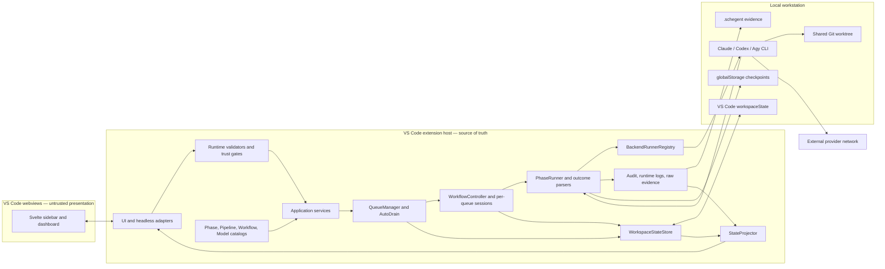
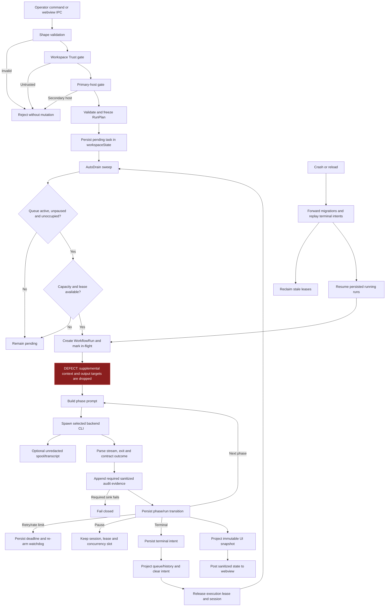

# Principal Architecture, Code, Security, Reliability, and Strategy Review

Review date: 2026-08-18

Scope: first-party source, documentation, configuration, tests, scripts, CI/release workflows, manifests, lockfiles, schemas, and migrations. Generated output was excluded from code-quality judgment except where it materially affected packaging. No repository files were modified as part of the review other than adding this report.

> **This report is a dated snapshot and is not edited to reflect fixes.** Its
> findings describe the tree as it stood on 2026-08-18. Where later
> verification found a *statement in this report* to be imprecise, an
> **Errata** note is added inline and the original wording is named; where a
> *finding* has since been remediated, the finding text is left exactly as
> written and the disposition is recorded in **Remediation status** below.
> Rewriting a finding to say "fixed" would destroy the record of what was
> found.

## Remediation status

Tracked as of 2026-08-18. Findings not listed here are open.

| ID | Finding (abridged) | Disposition |
|---|---|---|
| SEC-01 | Session retention can recursively delete outside the workspace through a symlinked root | **Fixed.** `session-artifact-retention-service.ts` now resolves the sessions root through `realpath` and refuses to prune when the resolved root is not contained by the resolved workspace root (`resolveContainedRoot()` returns `root-not-contained`). `realpath` was added to the service's `FsLike` seam, so the guard is testable without a real symlink. A refusal is recorded and retention becomes a no-op; it does not fall back to lexical containment. The *residual* surface — the per-candidate paths under a legitimately contained root, and every other recursive `fs.rm` in the host — is filed as a round-3 backlog item. |
| SEC-02 | Git/unrestricted execution approval is automatically granted | **Fixed.** `requestGitApproval` in `src/activation/run-safety-wiring.ts` now delegates to `createGitApprovalRequester` (`src/activation/git-approval.ts`), which **awaits** a modal `showWarningMessage` bound to the mutation-plan fingerprint and grants only on the explicit approve label. Dismissal resolves `undefined` and the modal's own Cancel button both deny. The `pipeline.git-approval-bypassed` path is gone. `--dangerously-skip-permissions` in the Claude and Agy runners is unchanged and out of scope: it is what the approval now actually gates. |
| SEC-03 | Workspace-configured runtime logs can alter or rotate arbitrary home files | **Fixed.** `os.homedir()` is no longer an allowed root in `src/activation/backend-wiring.ts`. The remaining three roots — workspace, `globalStorageUri`, OS temp — are all Schegent- or OS-owned scratch space. Containment is still lexical in `runtime-log-path.ts`, which is precisely why the root list had to narrow: a wide root is not rescued by a later check. |
| PRIV-01 | Phase-log redaction differed between the live tail and the reopened reader | **Fixed.** Both call sites now share one boundary scrub, `src/services/phase-log/phase-log-sanitizer.ts`, so a field cannot be redacted on one path and not the other. The audit found the gap was wider than reported: the tail also omitted `toolName` and `systemSubtype`, and never descended into `toolArguments` at all, so a `tool_use` event shipped a masked `toolInput` beside its cleartext structured original. Redaction itself stays in `SanitizedLogger`; the new module decides only *what* is scrubbed. |
| PRIV-02 | Unsafe raw-transcript and subprocess-environment defaults | **Fixed.** `schegent.logging.rawTranscriptMode` now defaults to `errors-only` and `schegent.cli.environmentMode` to `allowlist`. The review's CTO-005 prescribed `off`/`minimal`; the P0 row permitted `errors-only`/`allowlist`, which is what shipped — `off` would remove failure diagnosis, and `minimal` forwards no `PATH`, so every backend resolved by name would fail to spawn. Proxy and CA variables are documented as opt-in names rather than auto-forwarded, because a proxy URL can embed credentials. |
| REL-02 | Default concurrency of three shares one worktree without recoverable checkpoints | **Partially fixed.** The default global concurrency cap is now **1** across all six authority sites, so a fresh install no longer lands, unasked, in the configuration where checkpoints are declined. The range stays `[1, 20]` and concurrent execution stays supported. The underlying design problem — that a checkpoint cannot be attributed to one run in a shared worktree — is unfixed and filed as a round-3 backlog item; the decline itself is required behaviour, not a defect. |
| REL-03 | Package gate red; tag workflow weaker than the manual runbook | **Fixed.** `ALLOWED_VSIX_ENTRIES` in `scripts/check-vsix-smoke.mjs` was resynced against an actual `vsce package` (44 entries), and `.github/workflows/release.yml` now runs `package:smoke` and `test:integration` before publishing the artifact. |
| Doc Drift (all rows) | Pipelines/phases, `src/engine`, global storage, reload recovery, broken links | **Fixed.** See the errata note on the link scan below for counts. |
| CTO-009 | Audit is diagnostic evidence, not tamper-evident compliance evidence | **Fixed (docs half).** `docs/concepts/sessions-and-logs.md` and `docs/concepts/architecture-overview.md` now state the classification and why: the writer is append-only, the file is ordinary, and Schegent has no hash chain, signature, or external sink to detect edits. The word "immutable" is gone from the evidence definition. The stronger sink the directive names as an enterprise requirement remains unbuilt and unscheduled. |
| FUNC-01, FUNC-02, REL-01, CTO-007 | ExecutionEnvelope, mandatory queue identity, fenced ownership, coordinated reset | **Open — filed as round-3 backlog items.** Each is an architectural change spanning several seams, not a contained fix. |
| CTO-001, CTO-010 | Stop release / pilot activity; freeze architectural expansion | **Decided.** Both are accepted as one posture decision: engineering-preview label, no external distribution, and an expansion freeze until eight stated exit criteria hold. Six of the eight are the round-3 items below; the seventh is `npm run ci` observed end to end; the eighth is a repeat of this review by someone who did not perform the remediation. Remediation, tests, and docs are explicitly not frozen. |

Round-3 backlog items are in [`docs/features/round_3/`](../../../docs/features/round_3/) at the
workspace root: FR-R3-001 (FUNC-01), FR-R3-002 (FUNC-02), FR-R3-003 (REL-01),
FR-R3-004 (REL-02 residual), FR-R3-005 (SEC-01 residual), FR-R3-006 (CTO-007).
The CTO-001 / CTO-010 posture decision is recorded at
[`docs/architecture/release-posture-engineering-preview.md`](../../../docs/architecture/release-posture-engineering-preview.md),
also at the workspace root; it carries the exit criteria and the review
cadence, and is the record that gets updated as they are met.

## Executive assessment

Schegent is **partially coherent but drifting, and not release-ready**. Its architectural intent is strong: a local-first VS Code extension host owns typed orchestration, queue state, audit evidence, and backend CLI subprocesses, while Svelte webviews remain presentation-only. The current implementation nevertheless contains one **Critical** filesystem safety flaw, several **High** core-execution defects, incomplete multi-queue composition, unsafe consent/privacy defaults, non-atomic cross-window coordination, and a failing package gate.

Schegent 0.2.0 targets developers and technical leads running spec-driven workflows through Claude Code, Codex, or Agy. It is deployed as a local VSIX with no application server, although provider-backed execution is not necessarily offline ([ARCHITECTURE.md](../../ARCHITECTURE.md), [PRODUCT.md](../../PRODUCT.md), [package.json](../../package.json)).

### Evidence notation

- **O — Observed fact:** directly supported by source, configuration, tests, or an executed check.
- **I — Reasoned inference:** likely consequence of observed behavior.
- **U — Unknown:** insufficient repository evidence; not presented as fact.

The security review explicitly covered trust, paths, input handling, secrets, subprocesses, XSS/CSRF/SSRF, unsafe deserialization, dependency risk, and supply chain.

### Verification baseline

| Check | Result | Interpretation |
|---|---|---|
| `npm run verify:all` | **Passed** | Contracts, docs checks, secret scan, workflow pinning, licenses, host/webview/test typechecks, lint, and tests passed. |
| Host tests | **500 files / 6,745 tests passed** | Broad component and service coverage. |
| Webview tests | **110 files / 1,534 tests passed** | Strong component coverage; no enforced webview coverage threshold. |
| Combined | **8,279 tests passed** | High breadth, but decisive production composition seams remain untested. |
| `npm run test:integration` | **Passed** | VS Code 1.133 host suite passed independently. |
| `npm run ci` | **Not run to completion** | Inferred from the `package:smoke` result below rather than observed: `ci` chains thirteen targets and reaches `package:smoke` second-from-last, so a red smoke gate makes `ci` red — but the intervening `test:evals`, `test:visual`, `test:perf`, and `test:e2e` targets were not separately observed on this checkout and could have failed first. Reported as **Failed** in the original draft; corrected on post-audit verification. |
| `npm run package:smoke` | **Failed** | Unexpected `resolve-pipeline-name.js` and `tick-store.js`; pinned old chunks are absent. The script the target runs is [`scripts/package-vsix-smoke.mjs`](../../scripts/package-vsix-smoke.mjs), which packages into a temp directory and delegates the entry assertions to `ALLOWED_VSIX_ENTRIES` in [`scripts/check-vsix-smoke.mjs`](../../scripts/check-vsix-smoke.mjs); the stale pin is in the latter. |
| `npm audit --audit-level=low` | **Failed** | One High transitive development advisory, `nanoid@3.3.16`; a fix is available. Runtime exposure is low because the host package has no production dependencies. See [GHSA-2v37-7h3g-55p8](https://github.com/advisories/GHSA-2v37-7h3g-55p8). |
| `npm run docs:check` | **Passed** | The checker is too shallow to detect semantic drift or broken links; see [`scripts/check-docs.mjs`](../../scripts/check-docs.mjs). |

## Top findings and risk register

| ID | Finding | Severity / confidence | Evidence and consequence |
|---|---|---:|---|
| SEC-01 | Session retention can recursively delete outside the workspace through a symlinked root | **Critical / High** | **O:** Activation always invokes retention in [`src/extension.ts`](../../src/extension.ts). The root is assembled lexically, traversed, and candidates removed with recursive `fs.rm` in [`session-artifact-retention-service.ts`](../../src/services/session-retention/session-artifact-retention-service.ts). **I:** A trusted repository with `.schegent/sessions` symlinked outside the workspace can cause age/budget pruning of external directories. VS Code normally disables undeclared extensions in Restricted Mode, so exposure requires trust or override, but trusting a repository should not authorize external deletion. See [VS Code Workspace Trust](https://code.visualstudio.com/api/extension-guides/workspace-trust). |
| FUNC-01 | Validated RunPlan inputs, supplemental context, and output targets never reach the backend prompt | **High / High** | **O:** The complete plan is frozen in [`run-request-validator.ts`](../../src/services/run-request/run-request-validator.ts) and queued by [`queue-manager.ts`](../../src/queue/queue-manager.ts), but the factory and prompt path omit supplemental data and output targets in [`workflow-run-factory.ts`](../../src/services/workflow-run-factory.ts), [`phase-runner.ts`](../../src/controller/phase-runner.ts), and [`prompt-builder.ts`](../../src/runner/prompt-builder.ts). Outputs are merely probed after completion in [`run-driver.ts`](../../src/services/run-driver.ts). **I:** The backend cannot reliably consume the requested brief/files/context or know declared output destinations. |
| FUNC-02 | Multi-queue support is incomplete at production composition seams | **High / High** | **O:** Dashboard Start forwards a queue in [`cmd-start.ts`](../../src/ui/sidebar/commands/cmd-start.ts), but [`enqueue.ts`](../../src/commands/enqueue.ts) hardcodes Default. Scheduled-start wiring accepts `_queueId` then drops it in [`extension.ts`](../../src/extension.ts). Connected child lookup reads Default only in [`ui-wiring.ts`](../../src/activation/ui-wiring.ts). Lock-denied schedules rely on a watchdog whose tick is a no-op in [`schedule-watchdog.ts`](../../src/controller/schedule-watchdog.ts). **I:** Non-default tasks can be inserted or promoted in Default, active children can be misclassified as settled, and consumed schedules can remain pending indefinitely. |
| SEC-02 | Git/unrestricted execution approval is automatically granted | **High / High** | **O:** Production wiring displays a non-awaited warning, records `pipeline.git-approval-bypassed`, and returns `true` in [`run-safety-wiring.ts`](../../src/activation/run-safety-wiring.ts). Claude and Agy can use `--dangerously-skip-permissions` in [`claude-cli.ts`](../../src/runner/claude-cli.ts) and [`agy-cli.ts`](../../src/runner/agy-cli.ts). **I:** A warning is being treated as affirmative consent; the documented safety gate is not real. |
| SEC-03 | Workspace-configured runtime logs can alter or rotate arbitrary home files | **High / High** | **O:** Allowed roots include the entire home directory in [`backend-wiring.ts`](../../src/activation/backend-wiring.ts); containment is lexical in [`runtime-log-path.ts`](../../src/lib/runtime-log/runtime-log-path.ts); the sink appends, truncates, renames, and unlinks in [`runtime-log-sink.ts`](../../src/lib/runtime-log/runtime-log-sink.ts). **I:** Trusted workspace configuration or an intermediate symlink can target shell, Git, SSH, or other home files. |
| PRIV-01 | Live phase-log tails disclose structured tool arguments without recursive redaction | **High / High** | **O:** Initial reads recursively sanitize strings in [`phase-log-reader.ts`](../../src/services/phase-log/phase-log-reader.ts), but live tailing sanitizes only selected fields in [`phase-log-tail-session.ts`](../../src/services/phase-log/phase-log-tail-session.ts). Nested `toolArguments` are retained by [`phase-log-display-projector.ts`](../../src/services/phase-log/phase-log-display-projector.ts) and rendered by [`ToolCallCard.svelte`](../../webview-ui/src/components/PhaseLogFeed/parts/ToolCallCard.svelte). **I:** Secrets may appear live even though reopening the same log is safer. Svelte escaping makes this a disclosure issue, not demonstrated XSS. |
| REL-01 | Workspace primacy and execution leases are not atomic across windows | **High / Medium** | **O:** Both use read/check/write Memento operations without compare-and-swap in [`lock.ts`](../../src/state/lock.ts) and [`execution-lease.ts`](../../src/state/execution-lease.ts). Serialization in [`workspace-state.ts`](../../src/state/workspace-state.ts) is per store instance. **I:** Two extension hosts can both observe an empty lease and launch duplicate work. **U:** Exact cross-process Memento ordering guarantees are not documented in the repository. |
| REL-02 | Default concurrency three shares one Git worktree without recoverable checkpoints | **High / High** | **O:** Default global concurrency is three in [`package.json`](../../package.json). Documentation acknowledges the shared tree and that declined checkpoints do not stop execution in [`recovery-checkpoints.md`](recovery-checkpoints.md). [`run-checkpoint-service.ts`](../../src/services/run-checkpoint-service.ts) returns a marker rather than a checkpoint. **I:** Concurrent Git-capable runs can interleave edits, staging, and commits without reliable rollback. |
| REL-03 | The intended release gate is currently red, but the tag workflow omits it | **High / High** | **O:** `package:smoke` fails against current output. The tag workflow runs verify/build/plain packaging but not package smoke or host integration in [`release.yml`](../../.github/workflows/release.yml), while [`RELEASE.md`](../../RELEASE.md) requires stronger qualification. **I:** A tagged artifact can be created while the repository's intended packaging policy is failing. |
| PRIV-02 | Privacy and credential exposure defaults are too permissive | **High / High** | **O:** Raw transcripts default to `always`, 30 days, and 512 MiB in [`package.json`](../../package.json). Backend children inherit the extension host environment by default in [`spawn-env.ts`](../../src/runner/spawn-env.ts). **I:** Prompts, source, PII, and ambient cloud/registry/signing credentials may be retained or exposed beyond what a local-first user expects. |

## Phase 1 — Comprehension and architecture

### Documentation assessment

| Document | Purpose | Strengths | Gaps | Staleness Risk | Missing Critical Information |
|---|---|---|---|---:|---|
| [`README.md`](../../README.md) | Public overview, install, settings, security, development | Clearly communicates local-first operation, queues, multiple backends, and build targets | Says two pipelines/seven phases despite three built-ins and nine new-feature phases; timeout default is stale; five feature links are broken | **High** | Current generated pipeline table, definitive distribution path, checkpoint storage and deletion |
| [`ARCHITECTURE.md`](../../ARCHITECTURE.md) | Normative architecture and trust model | Strong trust, state, migration, reliability, and performance narrative | Documents nonexistent `src/engine`; omits AutoDrain/execution-lease admission; misassigns lock ownership; stale schemas and trust inventory | **High** | Actual dual-lease lifecycle, terminal journal, global-storage checkpoint ownership |
| [`PRODUCT.md`](../../PRODUCT.md) | Audience and UX principles | Concise audience, purpose, anti-patterns, WCAG 2.2 AA target | Lacks requirements, non-goals, support matrix, lifecycle, outcomes, and risk envelope | **Medium** | Concurrent-worktree risk, local/offline distinction, measurable product criteria |
| [`CONTRIBUTING.md`](../../CONTRIBUTING.md) | Contributor workflow and PR rules | Good repository map, security questions, test expectations, and documentation obligations | Misdescribes `ci:fast`; omits outer hard-rule routing; understates suite prerequisites | **High** | Canonical preflight, nested repository instructions, IPC/state architecture gates |
| [`docs/README.md`](../README.md) and concepts | Operator mental model and navigation | Broad, task-oriented organization | Still describes a single workspace lock and, in places, a single queue; phase catalog is obsolete | **High** | One current execution/lease model generated from implementation |
| Reference and runbooks | Settings, files, audit, recovery, operations | Detailed operational steps and examples | File layout says global storage is unused even though checkpoints live there; schema tables and raw-log behavior are stale | **High** | Complete data inventory, retention/deletion procedure, audit limitations |
| Security docs and ADRs | Threat model, parallelism, expansion boundary | Candid about prompt injection, shared-worktree risk, and remote/multi-user non-goals | Stale scope/command counts and single-queue assumptions; parallelism ratification admits an unmet approval criterion | **High** | Current four-scope/43-command inventory and formal implementation security signoff |
| [`RELEASE.md`](../../RELEASE.md) and workflows | Packaging, publication, rollback | Reproducible commands, SBOM/checksum artifact generation, forward-fix rollback | Marketplace publication is manual and its linked runbook is missing; automated tag gate is weaker than manual policy | **Medium** | Publisher protection, provenance/signing, tested install/rollback procedure |

A read-only link scan found missing relative targets, including README feature links, an architecture specification link, and the Marketplace guide. The documentation checker only validates a few tokens and lengths.

> **Errata (2026-08-18, post-audit verification).** This paragraph originally reported **14** missing relative targets. A full scan of every tracked `*.md` under `repo/` found **25**, in 14 files. The undercount appears to have come from scanning a subset of the tree rather than from a different definition of "missing". All 25 were repaired under feature 098; a re-scan of `repo/` now reports zero. The workspace-root `docs/` tree, which this review did not cover, had a further 72 outside `specs/` — 61 repaired, 11 left as pointers into components deleted by the operations task-first redesign and recorded only inside closed `DONE_*` items.

### System context

Major boundaries are extension activation/composition, TypeScript/Svelte UI adapters, guarded application services, QueueManager/AutoDrain admission, per-queue run controllers, backend subprocess adapters, Memento state, local evidence, global-storage checkpoints, and the shared Git worktree. No Docker, Compose, Kubernetes, Terraform, Helm, or devcontainer manifests were found; that is appropriate for a local extension and is not itself a defect.

### Architectural decisions and trade-offs

| Decision | Benefit | Cost or constraint |
|---|---|---|
| Host-authoritative state with thin webviews | Central consistency, runtime validation, strong CSP, easy snapshot testing | Composition root becomes a high-risk integration seam |
| One subprocess per phase | Backend interchangeability, cancellation, phase isolation | Startup overhead, ambient-environment exposure, provider/tool behavior outside host control |
| Memento plus filesystem evidence | No server/database operations; local persistence | No transactions or CAS; difficult cross-window fencing and atomic multi-key updates |
| Frozen pipeline/run snapshots | Reproducibility across catalog changes | Snapshot completeness is useful only if every frozen field reaches execution; currently it does not |
| Multi-queue admission with shared worktree | Local throughput and independent scheduling | Filesystem/Git conflicts and unrecoverable interleaving |
| Forward-only state migrations | Defensive corruption handling and explicit evolution | Downgrade is unsupported; migration/audit ordering is crash-sensitive |
| Typed IPC and runtime validators | Strong boundary contracts | Pinned registries and parity tests create maintenance overhead |
| Local evidence and no application telemetry exporter | Good operator control and low infrastructure burden | Ordinary local files are mutable and not compliance-grade tamper evidence |

### Primary control and state flow

## Phase 2 — Implementation reality check

### Structural quality

The repository has recognizable boundaries, strict TypeScript, runtime validators, dependency injection, immutable projections, and explicit state machines. The main maintainability problem is concentrated change blast radius:

- `src/state/workspace-state.ts`: approximately 1,934 lines.
- `src/queue/queue-manager.ts`: approximately 1,765 lines.
- `src/extension.ts`: approximately 1,296 lines.
- `src/services/run-driver.ts`: approximately 1,074 lines.
- `src/controller/workflow-controller.ts`: approximately 1,018 lines.

The LOC gate gives the two largest files 10,000-line ceilings in [`source-loc-budget.test.ts`](../../tests/lint/source-loc-budget.test.ts), so it does not meaningfully constrain those hotspots.

Multi-queue internals are addressable, but activation/command seams retain implicit Default-queue behavior. Initial and live phase-log paths duplicate sanitization logic and have diverged. Service/controller modules import some UI types; state imports controller/service values; config imports service types. Most observed imports are type-only, and no runtime circular dependency was proven. `QueueScheduleWatchdog.tick()` is a deliberate no-op even though surrounding recovery comments expect heartbeat behavior.

### Architecture drift register

| Type | Intended Design | Observed Reality | Evidence | Impact | Severity | Recommended Fix |
|---|---|---|---|---|---:|---|
| Doc Drift | One workspace lock and one active pipeline | Activation-long primacy plus per-queue execution leases permit parallel runs | [`architecture-overview.md`](../concepts/architecture-overview.md), [`lock.ts`](../../src/state/lock.ts) | Unsafe operator/recovery guidance | **High** | Rewrite around the dual-lease model and generate cardinality/tenure assertions |
| Doc Drift | Two pipelines and seven/eight feature phases | Three built-in pipelines; new-feature has nine declared phases | [`README.md`](../../README.md), [`pipeline-config.ts`](../../src/config/pipeline-config.ts) | Misstates behavior, duration, and extension surface | **High** | Generate docs from `BUILT_IN_PIPELINES` |
| Doc Drift | Older state and audit schemas | Runtime uses state v11 and audit v3 | [`state-schema.ts`](../../src/contracts/state-schema.ts), [`audit-events.ts`](../../src/contracts/audit-events.ts) | Recovery and compatibility guidance can be wrong | **High** | Publish one generated schema/version source |
| Design/Doc Drift | `src/engine` and `CurrentExtensionEngineAdapter` are shipped | Directory is absent; a release test asserts the entry point is absent | [`ARCHITECTURE.md`](../../ARCHITECTURE.md), [`release-qualification.test.ts`](../../tests/unit/build/release-qualification.test.ts) | Contributors may build against a nonexistent abstraction | **Medium** | Remove from normative docs or label as proposal |
| Design Drift | Queue ID flows end to end | Commands, schedules, and connected-run lookups fall back to Default | [`enqueue.ts`](../../src/commands/enqueue.ts), [`extension.ts`](../../src/extension.ts), [`ui-wiring.ts`](../../src/activation/ui-wiring.ts) | Wrong queue mutation and overlapping workflow children | **High** | Remove implicit defaults from addressed production APIs |
| Boundary Drift | Frozen RunPlan is the execution contract | Most composed fields stop before prompt generation | [`workflow-run-factory.ts`](../../src/services/workflow-run-factory.ts), [`prompt-builder.ts`](../../src/runner/prompt-builder.ts) | Valid UI requests are semantically ignored | **High** | Define one immutable execution-envelope contract consumed by PromptBuilder |
| Operational/Privacy Drift | Nothing is stored in global storage | Recovery checkpoints contain Git diffs under `globalStorageUri` | [`file-layout.md`](../reference/file-layout.md), [`run-checkpoint-service.ts`](../../src/services/run-checkpoint-service.ts) | Data inventory and deletion guidance omit source artifacts | **High** | Document and enforce cross-run retention/cleanup |
| Operational Drift | Reloaded in-flight runs recover to paused/failed | Activation resumes persisted `running` runs | [`workspace-lock.md`](../concepts/workspace-lock.md), [`extension.ts`](../../src/extension.ts) | Operators cannot predict reload side effects | **High** | Decide, test, and document one recovery policy |
| Operational Drift | Documentation checks keep architecture current | CI checks only a few strings/lengths and one-way directory substrings | [`check-docs.mjs`](../../scripts/check-docs.mjs), [`architecture-md-parity.test.ts`](../../tests/lint/architecture-md-parity.test.ts) | Green CI masks contradictions and dead links | **High** | Add links, generated catalogs, versions, trust inventory, and lease parity |
| Boundary Drift | Lower layers remain adapter-neutral | Services/state/config import types or values upward | [`run-driver.ts`](../../src/services/run-driver.ts), [`workspace-state.ts`](../../src/state/workspace-state.ts) | Raises extraction and headless-runtime cost | **Medium** | Move shared ports/types/constants into contracts/domain modules |

### Build and deployment reality

Strengths include lockfiles with integrity metadata, SHA-pinned GitHub Actions, `npm ci --ignore-scripts` in CI, CodeQL/dependency review, SBOM generation, three-OS testing, and no host runtime dependency tree.

Current CI is red at packaging; the tag workflow is weaker than the release manual; local root `postinstall` runs nested `npm install` while CI uses nested `npm ci`; and PRs trigger two substantially duplicated three-OS workflows. No signed provenance or independently protected publishing control is evidenced. Marketplace publisher protections, MFA, branch protection, and tested rollback installation remain unknown.

**Reality-check conclusion:** **partially coherent but drifting**. The domain architecture is understandable and generally disciplined, but production composition and operational gates no longer consistently implement or verify that design.

## Phase 3 — Deep code, state, testing, and operability review

### Strengths

- Strict TypeScript and explicit runtime reconstruction of inbound messages.
- Dependency-injected services and testable ports.
- Frozen catalog snapshots and forward migrations.
- Closed YAML subset with duplicate-key, alias/tag/directive, size, and UTF-8 protections.
- Structured retry/condition languages without `eval`.
- Terminal-intent journal for crash recovery.
- Bounded subprocess streams, timeouts, cancellation, and TERM/KILL escalation.
- Audit-required transitions fail closed when evidence cannot be written.

### Weaknesses

- Memento map updates are not cross-key or cross-window transactions.
- Queue identifiers remain optional/defaulted where explicit addressing is required.
- Reset does not coordinate with schedulers, drains, subprocesses, or leases and performs independent writes.
- Heartbeat promises can reject without an observed recovery path.
- Disposal releases execution leases before the workspace lock without `finally`.
- Audit uses ordinary filesystem appends, not a hash chain, signature, external sink, or append-only OS primitive.
- A `Promise.race` timeout does not cancel the underlying audit append.
- v10 migration events are returned by state initialization but omitted from activation forwarding; migrations happen before the audit writer exists.

### Testing gap analysis

| Area | Existing coverage | Missing decisive evidence | Risk |
|---|---|---|---:|
| Frozen RunPlan execution | Validation, frozen queue plan, runtime parity | Assert actual backend prompt contains brief, supplemental inputs, prior-output reference, and output targets | **High** |
| Dashboard queue targeting | Router verifies forwarding | Production `CMD_START → schegent.enqueue → QueueManager → drain` with a non-default queue | **High** |
| Scheduled starts | Coordinator unit tests | Production callback with non-default, offline-elapsed, reload, and lock-unavailable cases | **High** |
| Connected Workflow state | Custom all-queue test double | Production service with an active non-default child | **High** |
| Filesystem safety | Basic retention/logging behavior | Symlinked/junction root and intermediate-component tests on all supported OSes | **Critical** |
| Phase-log privacy | Initial reader and tail tested separately | Shared nested key/value canaries proving identical redaction live and after reopen | **High** |
| Lease correctness | Sequential owner/rival tests | Simultaneous acquire, reclaim-vs-heartbeat, and stale release with fencing | **High** |
| Reset/recovery | Basic reset and migrations | Active-run reset, partial-write failure, reload during reset, lease/schema cleanup | **High** |
| Packaging/release | Exact VSIX allowlist | Release workflow running the same package smoke and host integration gates | **High** |
| Accessibility | Roles, keyboard/focus, contrast-oriented tests | Axe/browser accessibility-tree gate and manual screen-reader verification | **Medium** |
| AI behavior | Ten deterministic fake eval scenarios | Real-backend/adversarial prompt injection, malicious tool args, cost ceilings, provider failures | **Medium** |
| Memory/concurrency | Fourteen performance budget tests passed | Extension-host RSS at 3 and 20 queues; large active phase logs and retention trees | **Medium** |

Host coverage thresholds are 80% statements/functions/lines and 75% branches, but `src/extension.ts` is excluded in [`vitest.config.ts`](../../vitest.config.ts). The webview config has no coverage threshold in [`webview-ui/vitest.config.ts`](../../webview-ui/vitest.config.ts). No confirmed flaky test was observed; the more important problem is mock-boundary overconfidence.

### Reliability and AI-specific assessment

The implementation has mature local recovery mechanisms: retries, persisted deadlines, rate-limit classification, cancellation, terminal journaling, stale-lease reclaim, state migrations, and fail-closed audit handling. The systemic weaknesses are unfenced admission ownership, incomplete scheduled-start recovery, loss of queue identity at adapters, shared-worktree parallelism, non-quiescent reset, and non-atomic audit/state persistence.

Phase prompts are centralized and testable, but the composed RunPlan contract is not routed to them. Argument arrays and `shell:false` reduce shell injection, while model/tool prompt injection remains explicitly unmitigated and dangerous permission bypass amplifies impact. Frozen pipeline/model/mutation settings aid reproducibility. Deterministic fake evals are useful but do not establish real-provider behavior, adversarial safety, or enforceable token/cost ceilings. Silent model fallback should remain avoided.

### Observability

Schegent has strong local observability: structured audit events, runtime logs, raw/verbose evidence, evidence health, metrics, phase feeds, history, and recovery diagnostics. It lacks host-to-provider tracing and provider/network health modeling. Local audit files can be edited or deleted by the same user or another extension and must not be represented as compliance-grade tamper evidence.

## Phase 4 — Ecosystem and strategic comparison

| Approach | Extensibility | Complexity / operations | Privacy and isolation | Developer experience |
|---|---|---|---|---|
| **Schegent** | Strong typed workflow/catalog seams; backend type remains closed | Low infrastructure burden, high local coordination complexity | Local control plane, but unsafe raw/env defaults and shared worktree | Focused deterministic SDD flow; broken composition currently undermines it |
| **GitHub Spec Kit** | Broad agent/integration workflow surface | Lower runtime orchestration burden | Supports offline/air-gapped setup; less built-in evidence/admission control | Portable SDD harness. [Spec Kit](https://github.com/github/spec-kit), [air-gapped installation](https://github.github.com/spec-kit/install/air-gapped.html) |
| **Continue** | Models, tools, MCP, IDE customization, local providers | More provider flexibility; less deterministic pipeline control | Ask-first permissions and local/offline configurations | Strong interactive agent UX. [Agent quick start](https://docs.continue.dev/ide-extensions/agent/quick-start), [offline guide](https://docs.continue.dev/guides/running-continue-without-internet) |
| **Cline** | Extension/CLI/SDK, MCP/plugins, checkpoints, worktree features | Larger feature and integration surface | Human approval and isolation options | Broad ecosystem; Schegent is more workflow-focused. [Cline](https://github.com/cline/cline) |
| **OpenHands** | Broad runtime/server tooling | Higher Docker/client-server burden | Stronger sandbox consistency and resource isolation | Better isolation with container cost. [Runtime architecture](https://docs.openhands.dev/openhands/usage/architecture/runtime) |

Do not replace internal typed queue/state services with MCP: MCP would not solve leases, worktree isolation, or RunPlan propagation. Optional, capability-scoped MCP adapters may later serve read-only external context and status, with explicit tool consent, data minimization, authorization audience binding, and allowlists. MCP guidance emphasizes authorization/user consent, and tool annotations are not a prompt-injection defense ([MCP authorization](https://modelcontextprotocol.io/specification/2025-06-18/basic/authorization), [tool annotation limitations](https://blog.modelcontextprotocol.io/posts/2026-03-16-tool-annotations/)).

An external message broker is unjustified for a single-user desktop extension; an atomic local lock or small transactional store is enough. Per-run worktrees or optional containers directly address mutation isolation without a full client-server conversion. A local model runner could enable true offline operation, but must satisfy the phase/tool contract and be selected explicitly. No Svelte/reactive rewrite is justified.

Schegent's differentiator is a focused operator-grade control plane: explicit phases, queues, deterministic snapshots, local evidence, and per-phase backend choice without an application server. Its strategic weaknesses are the unhonored composed request contract, partial multi-queue wiring, inadequate mutation isolation/consent, unsafe privacy defaults, and tests that miss production seams.

## Phase 5 — Security, privacy, performance, portability, and edge cases

### Threat model

| Surface | Confirmed controls | Residual risk / conclusion |
|---|---|---|
| Auth/authz | No application server; Workspace Trust and primacy gate local mutations | Traditional authentication and CSRF are not applicable. Remote/multi-user expansion requires identity, authorization, and tenancy design. |
| Webview/XSS | Nonce CSP with `default-src 'none'` and `connect-src 'none'`; centralized inbound validation; Svelte escaping | No active raw-HTML rendering was found. Live log leakage is privacy exposure rather than XSS. |
| Command/process injection | Argument arrays, `shell:false`, prompt through stdin, timeout/cancellation | Model/tool prompt injection remains unmitigated; permission bypass amplifies impact. |
| Deserialization | Closed YAML subset, prototype-less objects, duplicate-key/tag/alias/directive rejection; no `eval` | Retry expression length/token/nesting is unbounded. YAML is loaded before parser size enforcement. |
| SSRF/network | Webview cannot connect; no host application HTTP client found | Backend CLI tools may fetch URL inputs or contact providers outside host enforcement. |
| Filesystem | Some final-file no-follow and traversal checks | Session retention is Critical; runtime logs and run input/output containment do not securely handle intermediate symlinks/junctions and TOCTOU. |
| Secrets | Secret scan, audit redaction, minimal/allowlist environment modes | Default inherited environment and raw evidence expose ambient secrets. |
| Supply chain | No root runtime dependencies; lock integrity; SHA-pinned Actions; CodeQL; dependency review; SBOM | One High development advisory; nested local install differs from CI; signing/provenance and publisher controls are unknown. |
| Audit/compliance | Structured local events and recovery evidence | Ordinary files are not tamper-evident; migration audit is incomplete. |
| Lateral movement | Workspace Trust reduces pre-trust execution; subprocesses are locally selected | Trusted CLIs inherit user privileges and may skip permission prompts; no OS/container sandbox exists. |

### Local-first, performance, and portability

UI state, queues, evidence, and orchestration are local. No host analytics exporter or application network service was found. Provider-backed Claude/Codex/Agy execution, remote authentication, and backend tools may fail offline. There is no automatic network detector, offline queue mode, or local fallback. A true offline mode requires an explicit local-runner capability contract and clear scheduling of network-required phases.

Fourteen blocking performance tests passed. Budgets cover regex behavior, catalog p95, projection, activation, stream retention, and phase logs in [`tests/perf/budgets.json`](../../tests/perf/budgets.json). Each invocation has a 64 MiB logical ceiling for stdout and stderr, or 128 MiB per invocation; default concurrency three therefore permits 384 MiB of logical stream content before other host/process/UI costs. Actual resident memory may be lower and is not measured. Initial phase-log reads and unread tail deltas are allocated wholesale before display caps.

The product targets WCAG 2.2 AA and component tests cover roles, focus, keyboard behavior, and themes. No automated axe/browser accessibility-tree gate or documented manual screen-reader audit was found. Internationalization remains minimal. Three-OS CI is a strong portability control, while remote workspaces, virtual filesystems, Windows junctions, case-insensitive paths, and provider CLI parity remain insufficiently evidenced.

### Additional edge cases

- Active execution can repopulate state during reset.
- An incompatible schema-version key may survive reset.
- Deep retry expressions can exhaust stack or CPU.
- Input/output path validation is vulnerable to intermediate symlink changes.
- Phase logs can exhaust memory before display truncation.
- Migration audit events can be lost between migration and writer startup.
- A lock-denied scheduled start removes its timer and receives no automatic retry.
- A non-default active Workflow child can be interpreted as settled.
- Paused runs intentionally retain session, lease, and concurrency capacity.

## Phase 6 — Recommendations and release posture

### CTO decision record

Decision date: 2026-08-18

**Decision: NO-GO for release.** The current branch may continue as an engineering-development branch, but no VSIX, Marketplace release, customer pilot, or production-use recommendation is authorized until Release Gate A and Release Gate B below are satisfied. This is a risk-based decision, not a judgment that the architecture should be replaced.

The following decisions are effective immediately. “Owner” identifies the accountable engineering function; named individual assignment remains a management action outside this repository review.

| ID | Binding decision | Rationale | Owner | Exit criteria |
|---|---|---|---|---|
| CTO-001 | **Stop release and external pilot activity.** Keep the product labeled “engineering preview.” | A Critical external-deletion path, ignored RunPlan data, wrong-queue behavior, fake consent, privacy leakage, and a red package gate make current release risk unacceptable. | CTO / Release owner | CTO-002 through CTO-005 are verified; `npm run ci`, package smoke, and host integration are green from a clean checkout. |
| CTO-002 | **Contain filesystem mutation first.** Disable automatic session pruning until a secure root implementation lands. Runtime logs may target only a verified Schegent-owned directory under workspace `.schegent` or VS Code global storage; arbitrary home paths are removed. | Data loss outside the workspace has the highest impact and shortest exploit path after a workspace is trusted. | Security + Host runtime | Canonical root/component verification, symlink/junction rejection, exact run-ID deletion allowlist, secure open semantics, ownership marker, and cross-platform adversarial tests. |
| CTO-003 | **Adopt one immutable `ExecutionEnvelope` as the runtime contract.** It must contain pipeline snapshot, normalized primary inputs, supplemental context, prior-output references, output targets, model/runner policy, mutation plan, and approval receipt. No downstream component may reconstruct or selectively copy this contract. | The accepted user request is currently not the request executed by the backend. A single envelope removes silent semantic loss. | Workflow execution | End-to-end tests inspect the real backend invocation and prove every supported input/context/output kind is present, stable across reload, and auditable without leaking sensitive values. |
| CTO-004 | **Queue identity becomes mandatory at every addressed API.** Remove implicit Default-queue fallbacks from commands, scheduling, connected-run lookup, store mutation, drain, audit ACKs, and host composition. | Default arguments hide incorrect routing and make multi-queue tests pass below the broken composition seam. | Queue/workflow | Production-facade tests pass for Default and at least two non-default queues, including Start, scheduled fire, offline re-arm, lock contention, child continuation, reload, and audit projection. |
| CTO-005 | **Require real consent and adopt privacy-minimizing defaults.** Git/unrestricted work requires an awaited modal approve/cancel decision bound to the exact mutation fingerprint. Raw transcripts default to `off`; child environments default to minimal/explicit allowlist; live and reopened logs use one recursive sanitizer for keys and values. | Operator consent must be affirmative, and local-first should not silently retain unredacted prompts or expose ambient credentials. | Security + Product UX | Approval/refusal tests, nested redaction canaries, environment-policy migration, explicit raw-capture opt-in UX, documented locations/retention, and no sensitive values in sanitized UI/audit fixtures. |
| CTO-006 | **Default mutation concurrency is one.** Concurrency above one is re-enabled only with per-run Git worktrees and fenced workspace ownership. Use an OS-atomic workspace primacy claim with a unique epoch/fencing token; treat Memento leases as recovery metadata, not the authority to spawn. | This is the smallest architecture that addresses split brain and shared-tree mutation without introducing a server or broker. | Platform/reliability | Simultaneous-acquisition tests prove one primary; every spawn validates the current fence; stale owner operations are rejected; isolated worktrees are created/cleaned safely; crash/reload and Git conflict tests pass. |
| CTO-007 | **Reset becomes a coordinated maintenance transaction.** It must reject or quiesce active work, stop timers/drains, cancel children, release leases, clear every version/state key, and commit through a generation marker before reload. | The current reset can race active workers, partially clear state, and recreate data after confirmation. | State/reliability | Failure-injection tests cover cancellation failure, partial persistence, competing windows, restart at every stage, and idempotent retry. |
| CTO-008 | **The release workflow is the policy authority and must be at least as strict as the manual runbook.** Tags cannot package until the full clean-checkout gate, package smoke, dependency policy, VS Code host integration, and artifact inspection pass. | Human documentation must not describe gates that automated release can bypass. | Release / DevEx | One required release workflow produces the tested VSIX, SBOM, checksums, and provenance; stale exact asset lists are generated or intentionally updated; rollback installation is rehearsed. |
| CTO-009 | **Audit is classified as diagnostic evidence, not tamper-evident compliance evidence.** Product/docs wording must state this limitation. A stronger append-only/hash-chained or external sink is a separate enterprise requirement. | The current local file can be modified or deleted by the same user or another extension. | Product + Security | All claims and runbooks use the approved classification; migration audit outbox is durable; retention/deletion is documented. |
| CTO-010 | **Freeze architectural expansion until core gates pass.** No new backend, MCP integration, remote/multi-user mode, external broker, UI framework rewrite, or major workflow surface is approved during P0/P1 stabilization. | Expansion would increase attack and regression surface before existing execution semantics are trustworthy. | CTO / Product | Release Gates A–C are green and the architecture review is repeated against the remediated code. |

### Chosen architecture, not open questions

The following choices resolve alternatives raised by the review:

| Topic | Decision | Explicitly not chosen now |
|---|---|---|
| Cross-window ownership | OS-atomic workspace primacy plus epoch/fencing checks before side effects | Memento-only authority; an external broker; distributed consensus |
| Parallel mutation | Per-run Git worktrees, with concurrency one until available | Multiple mutating agents in one worktree; containers as a mandatory baseline |
| Execution data | One versioned immutable `ExecutionEnvelope` consumed end to end | Selective field copying between queue, run, phase, and prompt types |
| Privacy | Raw transcript `off` by default; minimal environment; explicit opt-in | Raw `always`; full inherited environment as default |
| Tool consent | Awaited approval bound to an exact mutation plan | Informational warning followed by automatic approval |
| MCP | Optional future adapter for capability-scoped external context/status | Replacing internal queue, state, or domain services with MCP |
| State technology | Keep Memento for durable product state after authority is moved to an atomic fence | Immediate database rewrite |
| UI technology | Keep Svelte and snapshot projection | Framework rewrite before host correctness is restored |
| Audit posture | Local diagnostic/forensic evidence | Claiming immutability, non-repudiation, or compliance-grade auditability |

### Release gates and sequence

| Gate | Required scope | Decision authority | Target horizon |
|---|---|---|---|
| **Gate A — Safety containment** | Secure/disabled retention deletion, constrained runtime-log path, raw default off, environment minimal, real mutation approval, shared recursive sanitizer | Security owner + CTO | **Days** |
| **Gate B — Core correctness** | End-to-end ExecutionEnvelope, mandatory queue identity, scheduled-start recovery, connected-child correctness, coordinated reset, production-facade regressions | Workflow/State owners + CTO | **1–2 weeks** |
| **Gate C — Release qualification** | Clean full CI, package smoke, host integration, dependency policy, docs/link parity, artifact/SBOM/provenance inspection | Release owner | **2–4 weeks** |
| **Gate D — Safe concurrency** | Atomic fenced primacy, per-run worktrees, crash/failure tests, concurrency/RSS budgets | Platform owner + Security | **3–8 weeks** |
| **Gate E — Expansion** | Re-review permits additional backends, local runner, optional MCP adapters, or remote design work | CTO / Product / Security | **After Gates A–D** |

Gate A and Gate B may proceed in parallel on isolated modules, but release remains blocked until both are complete. Gate D is not required to ship with concurrency fixed at one; it is required before increasing the cap. Dependency upgrades, documentation generation, and CI consolidation may proceed alongside Gate C but must not displace P0 work.

### Prioritized recommendations

| Priority | Recommendation | Why It Matters | Evidence | Expected Impact | Effort | Time Horizon |
|---|---|---|---|---|---|---|
| **P0** | Quarantine filesystem mutation: disable retention pruning until roots are verified; remove home as a runtime-log root; enforce canonical component checks, no-follow handles, run-ID allowlists, ownership markers, and mode `0600` | Prevents catastrophic external deletion and home-file corruption | [`session-artifact-retention-service.ts`](../../src/services/session-retention/session-artifact-retention-service.ts), [`runtime-log-path.ts`](../../src/lib/runtime-log/runtime-log-path.ts) | Removes the Critical data-loss path | Medium | **Quick Win — days** |
| **P0** | Carry one immutable RunPlan envelope through factory, RunDriver, PhaseRunner, and PromptBuilder; make queue IDs mandatory through commands, scheduling, child state, and drain wiring; add production-facade tests | Restores the core product contract and makes multi-queue behavior truthful | [`run-request-validator.ts`](../../src/services/run-request/run-request-validator.ts), [`enqueue.ts`](../../src/commands/enqueue.ts) | Correct backend work and queue targeting | High | **1–2 weeks** |
| **P0** | Require awaited modal consent bound to the exact mutation fingerprint; use one recursive live/read sanitizer; default raw transcripts to `errors-only` or `off`; default environment to minimal/allowlist | Prevents unapproved mutation and reduces secrets/PII exposure | [`run-safety-wiring.ts`](../../src/activation/run-safety-wiring.ts), [`phase-log-tail-session.ts`](../../src/services/phase-log/phase-log-tail-session.ts), [`package.json`](../../package.json) | Materially improves operator trust and privacy | Medium | **Quick Win — days** |
| **P1** | Replace Memento read/write leases with atomic or transactional fenced ownership; default mutation concurrency to one until worktrees or a Git-phase mutex exist; make reset quiescent and transactional | Prevents split brain, duplicate subprocesses, interleaved Git mutation, and state resurrection | [`lock.ts`](../../src/state/lock.ts), [`package.json`](../../package.json), [`reset.ts`](../../src/commands/reset.ts) | Makes concurrency and recovery credible | High | **Medium-Term — 3–8 weeks** |
| **P1/P2** | Make the tag workflow run package smoke and full qualification; generate pipeline/schema/trust docs; add link checking; decompose state/queue/composition hotspots; make backend registration dynamic before MCP/local-runner expansion | Stops release/docs signals from diverging from runtime reality | [`release.yml`](../../.github/workflows/release.yml), [`check-docs.mjs`](../../scripts/check-docs.mjs), [`source-loc-budget.test.ts`](../../tests/lint/source-loc-budget.test.ts) | Better release confidence, onboarding, and extensibility | Medium–High | **Weeks to months** |

Until multi-queue production seams and worktree isolation are repaired, set the effective global concurrency cap to **1** and disable non-default scheduled starts rather than exposing behavior that appears supported but is not reliable.

### Do-not-ignore risks

Release must be blocked on:

1. External recursive deletion through session retention.
2. Frozen RunPlan data not reaching execution.
3. Wrong/default queue wiring and consumed schedules without retry.
4. Automatic Git/unrestricted approval.
5. Live structured-log privacy leakage.
6. The failing package smoke gate.

Remote or multi-user expansion must additionally be blocked on atomic ownership/fencing, worktree isolation, a real backend capability/permission model, tamper-evident audit requirements, and identity/tenant authorization.

Schegent should be treated as an engineering preview until the P0 items are fixed. Its audit files are useful local diagnostics but must not be marketed or relied upon as immutable compliance evidence.

## Scorecard

| Area | Score | Justification |
|---|---:|---|
| Documentation | **2/5** | Rich and broad, but materially stale on pipelines, leases, schemas, storage, recovery, and release; checks miss the drift. |
| Architecture | **3/5** | Coherent local-first, host-authoritative design with strong typed boundaries; shared worktree and incomplete composition weaken it. |
| Code Quality | **3/5** | Strict, readable, and dependency-injected, but oversized modules, hidden Default-queue assumptions, and duplicated sanitization increase risk. |
| Testing | **3/5** | 8,279 passing tests and wide suite diversity, yet core production seams and filesystem adversaries are not exercised. |
| Security | **2/5** | Strong CSP, IPC validation, closed parsing, and `shell:false`; outweighed by Critical deletion, unsafe log paths, fake consent, and skipped CLI permissions. |
| Privacy | **2/5** | Local control is valuable, but raw-by-default retention, inherited environment, live argument leakage, checkpoints, and unknown provider policy are serious gaps. |
| Reliability | **2/5** | Journaling, retries, migrations, and bounded streams are good; non-atomic leases, schedule failures, reset races, and wrong-queue execution are release blockers. |
| Performance | **4/5** | Blocking budgets pass and buffers are bounded; concurrency RSS, whole-file phase logs, and large retention scans remain unmeasured. |
| Observability | **4/5** | Excellent local evidence, metrics, health, history, and diagnostics; no provider tracing and no tamper-evident audit. |
| Extensibility | **3/5** | Workflow/catalog and runner interfaces are useful seams, but backend kinds remain closed and state/composition are monolithic. |
| DevEx | **3/5** | Strong scripts, multi-OS CI, tests, and guidance; broken links, duplicated CI, local/CI install drift, and a red package gate reduce confidence. |
